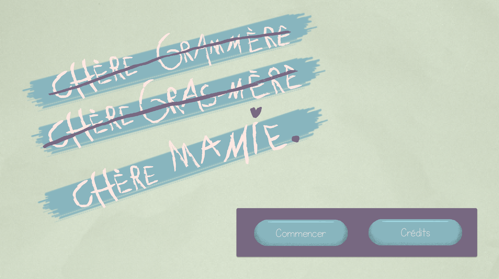
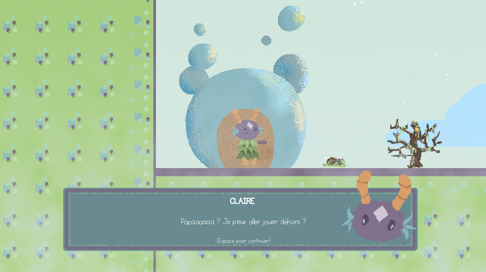
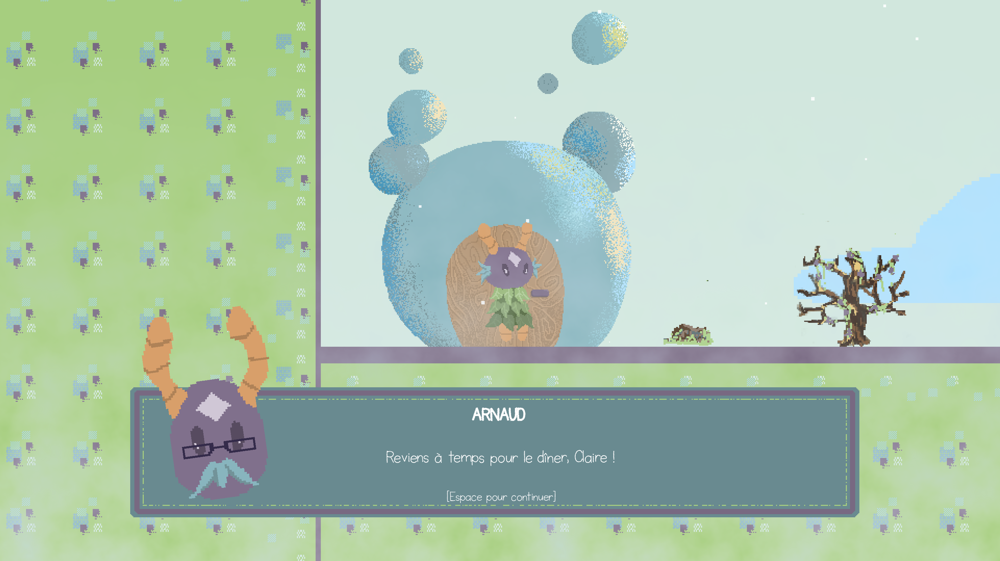
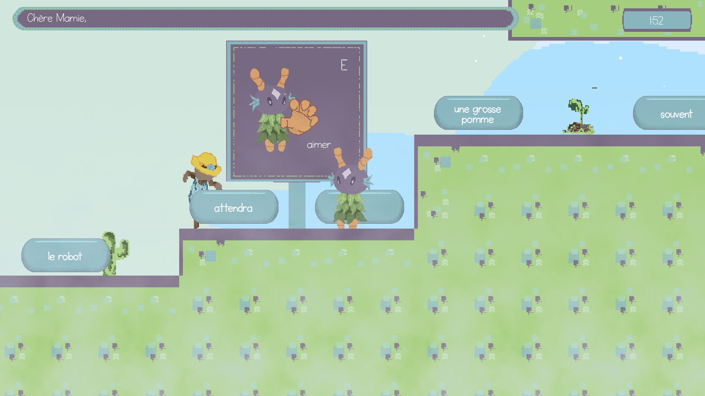
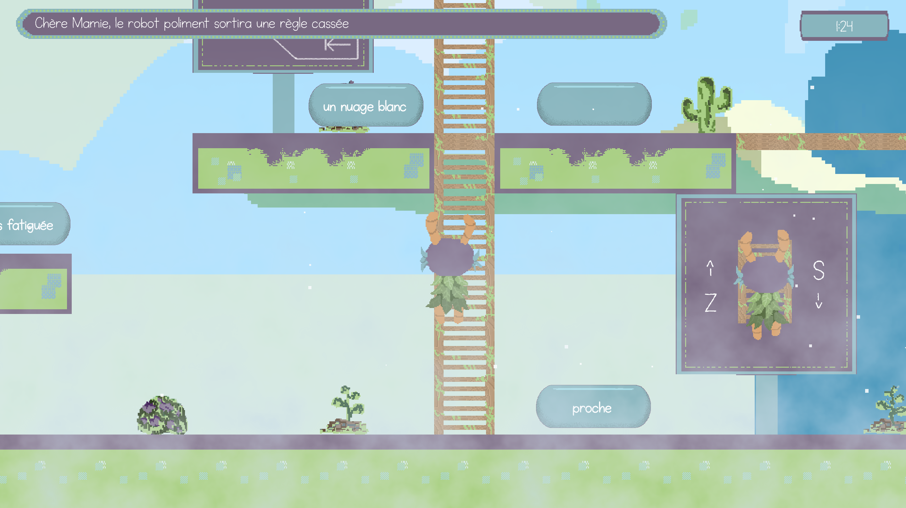
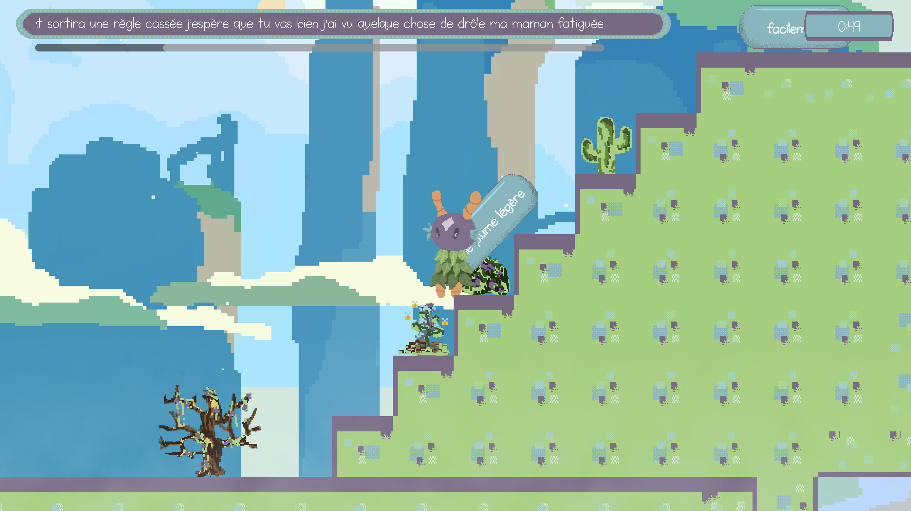
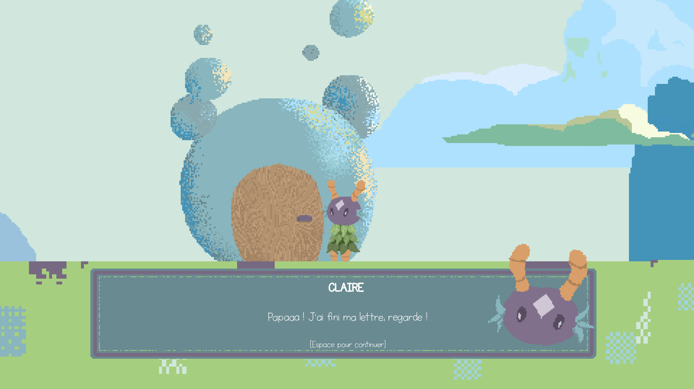
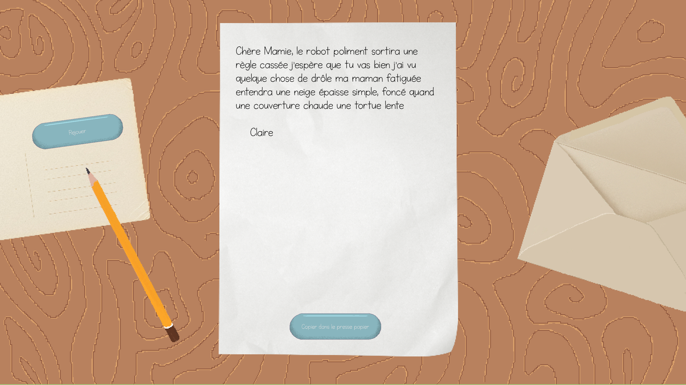
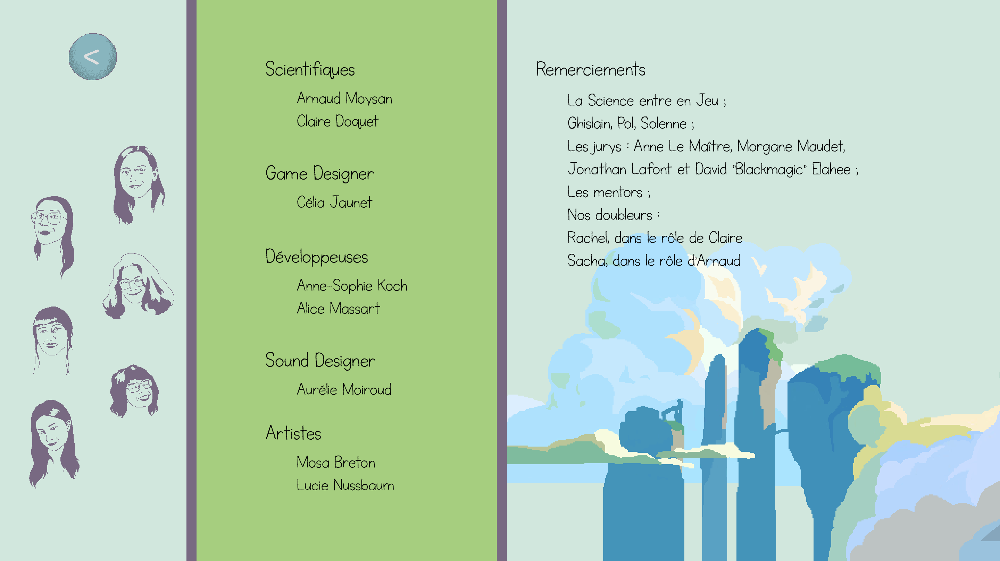

titre : "Chère Mamie..."
date : "Mars 2026"
position : "center center"

Jeu créé pendant la Scientific Game Jam Online 2026  
Lien vers tous les jeux : [https://itch.io/jam/scientific-game-jam-2026](https://itch.io/jam/scientific-game-jam-2026)

## Description
### Résumé
Incarnez l'aventure mentale d'une enfant qui souhaite écrire une lettre à sa grand-mère. Trouvez les mots adéquats et écrivez la meilleure lettre possible (ou la moins pire) !

### Aspect scientifique
Se mettre dans la peau d'un enfant aux prises avec le langage écrit et ses dynamiques intrinsèques : chercher des mots, construire des phrases, élaborer un texte.

### Équipe
Arnaud MOYSAN et Claire DOQUET *- scientifiques*  
Célia JAUNET *- game Designer*  
Anne-Sophie KOCH et Alice MASSART *- développeuses*  
Mosa BRETON et Lucie NUSSBAUM *- artistes 2D & UI*  
Aurélie MOIROUD *- sound designer & compositrice*  

## Mes outils
- Godot
- Visual Studio Code
- Krita

## Téléchargement

    <iframe
    frameborder="0"
    src="https://itch.io/embed/4375491"
    width="100%"
    height="100%"
    style="border-radius:10px;">
        <a href="https://alice-massart.itch.io/imposipdf">Chère Mamie... by Runthia, Alice-Massart, Ankos, Lucie Nussbaum, Mosa Breton, Aurelie, Amoysan</a>
    </iframe>

## Galerie

