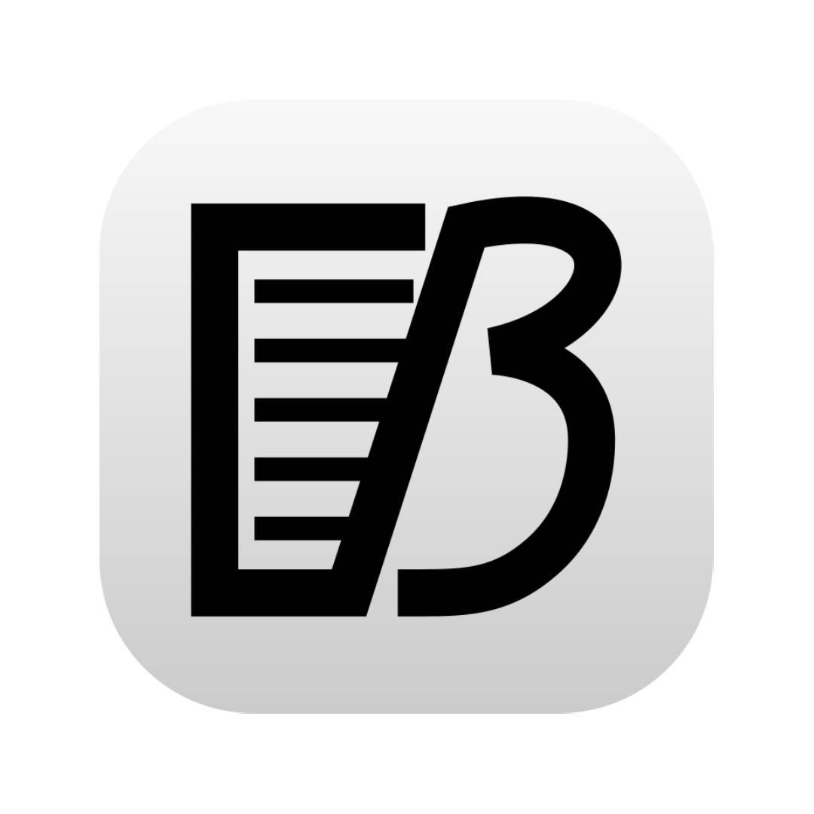
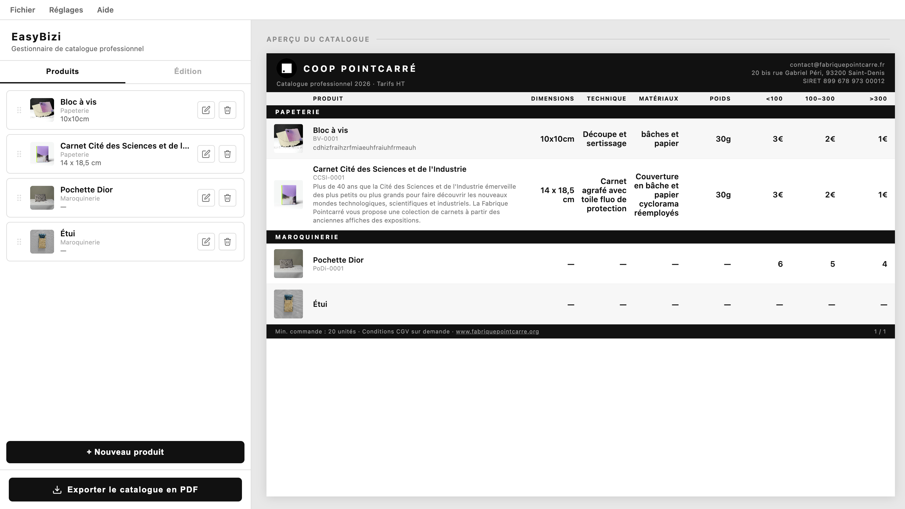

titre : "EasyBizi"
date : "Juin - Juillet 2026"
position : "center center"

## Description

Outil permettant de créer un catalogue de produit.

## Fonctionnalités

- Interface no code accesible à tous les utilisateurs
- Export en PDF prêt à l'impression
- Langues d'interface : Français et Anglais
- Possibilité de travail dans un fichier partagé

## Outils
- HTML
- CSS
- JS
- JSON
- node
- electron

## Contexte

Suite à une réunion client lors de mon stage à la Fabrique Pointcarré, l'équipe a émis le besoin d'avoir un catalogue de produit condensé et dissocié de l'e-shop afin de montrer la diversité des productions.  
Je me suis donc lancée dans le développement du logiciel EasyBizi qui répond à cette demande.

## Galerie

