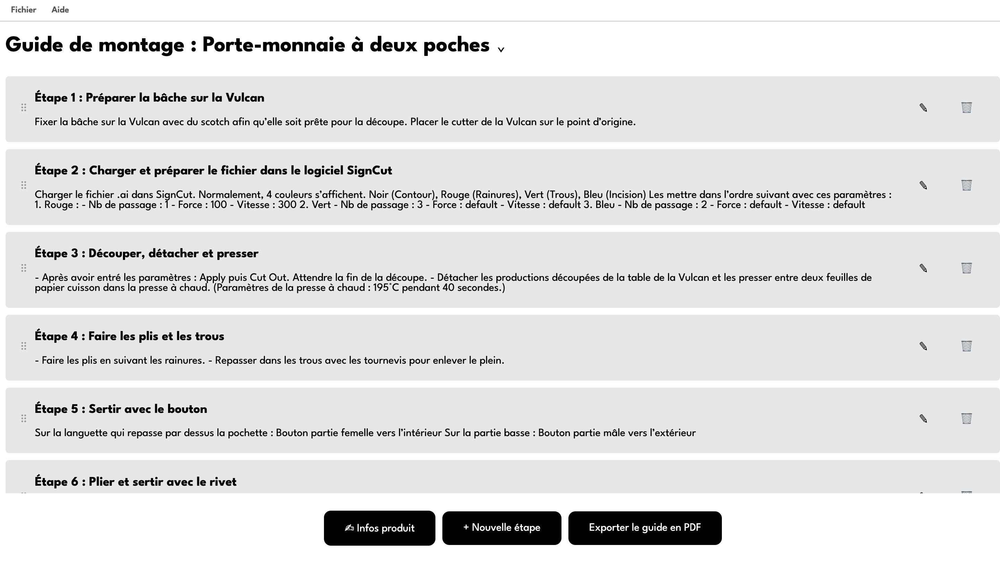

titre : "EasyBizi"
date : "Juin - Juillet 2026"
position : "center center"

## Description

Outil permettant de créer un catalogue de produit.

## Fonctionnalités

- Interface no code accesible à tous les utilisateurs
- Export en PDF prêt à l'impression

## Outils
- HTML
- CSS
- JS
- JSON
- node
- electron

## Contexte

Lors de mon stage à la Fabrique Pointcarré, l'équipe a émis le besoin d'avoir des guides de fabrication uniformisés. Ne pouvant passer par le graphiste prestataire (Blaise GUILLOTIN) à chaque fois qu'un guide est nécessaire, j'ai choisi d'automatiser la tâche de mise en page dans un logiciel facilement accessible à l'équipe.
Je me suis donc lancée dans le développement du logiciel Éditeur de guide de montage qui répond à cette demande.

## Galerie

