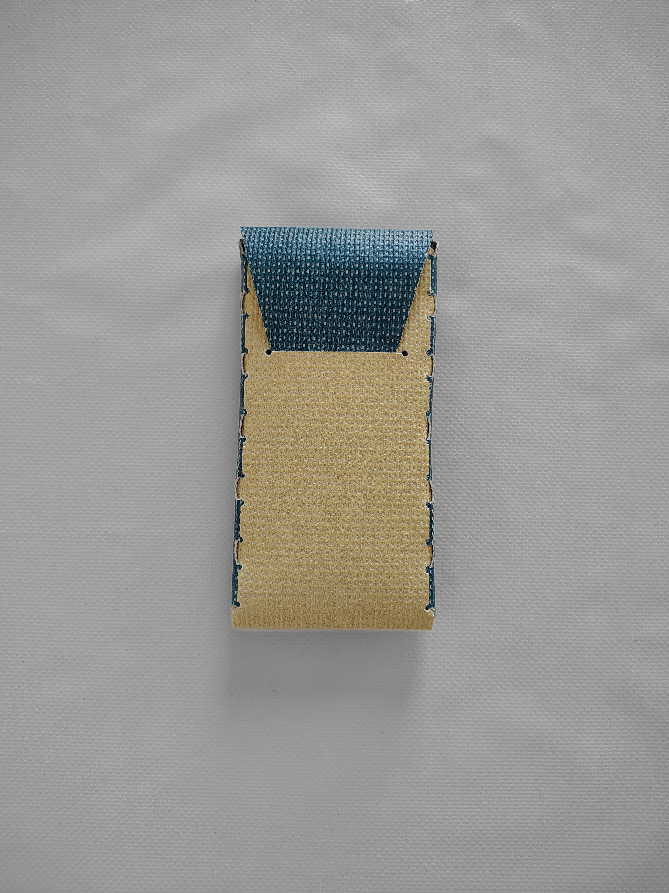
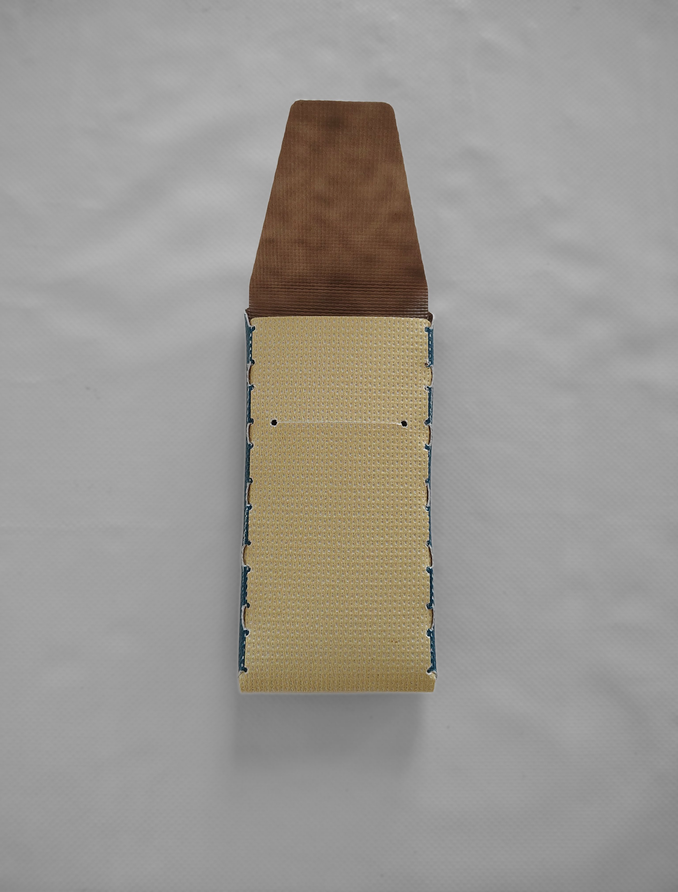
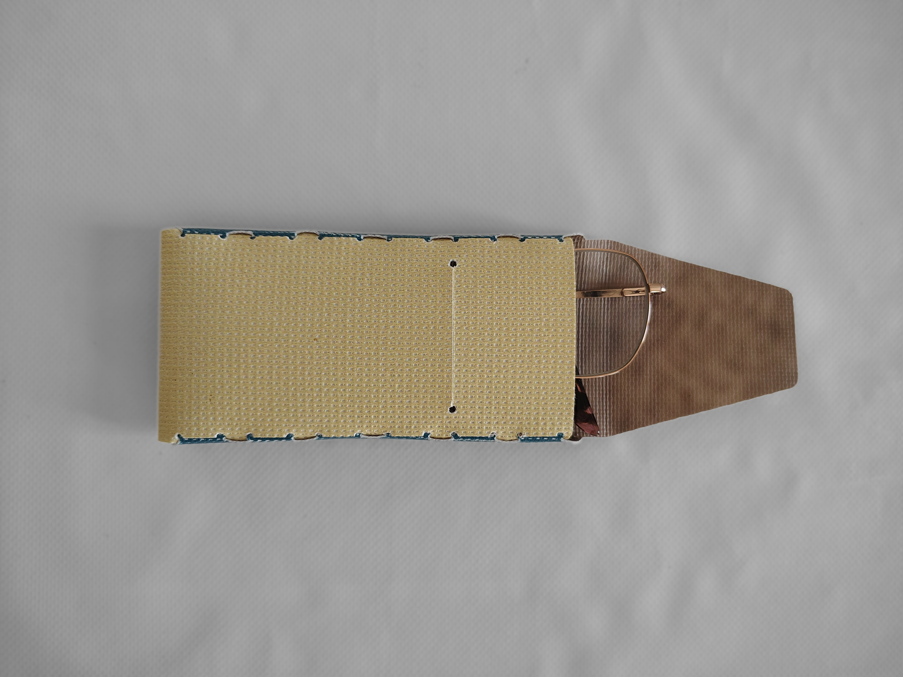
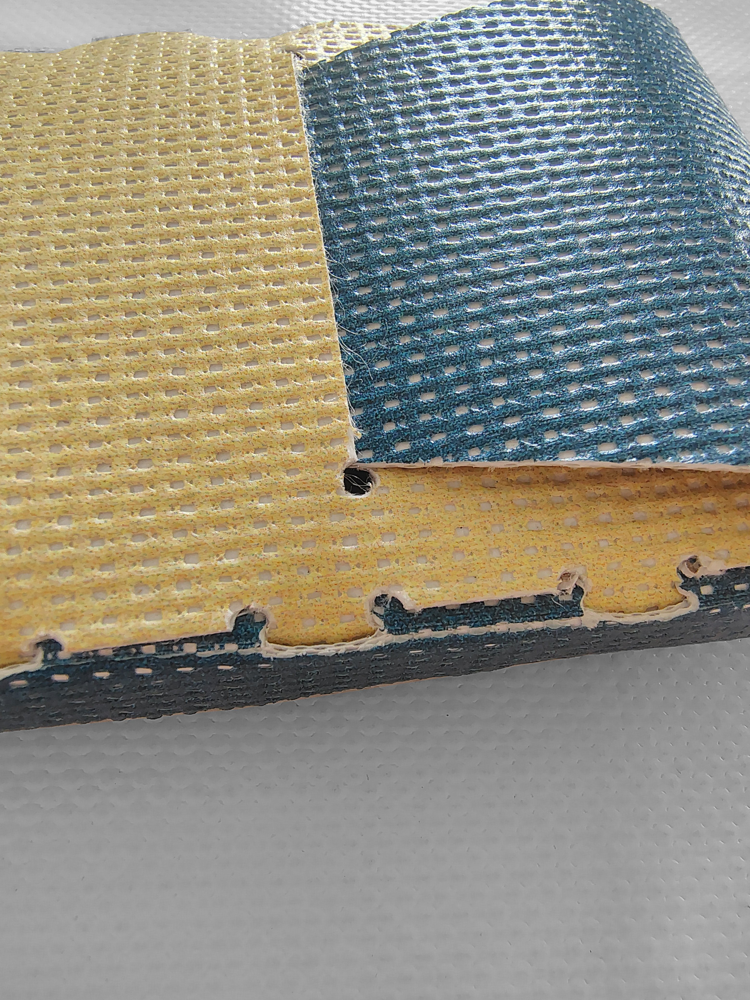
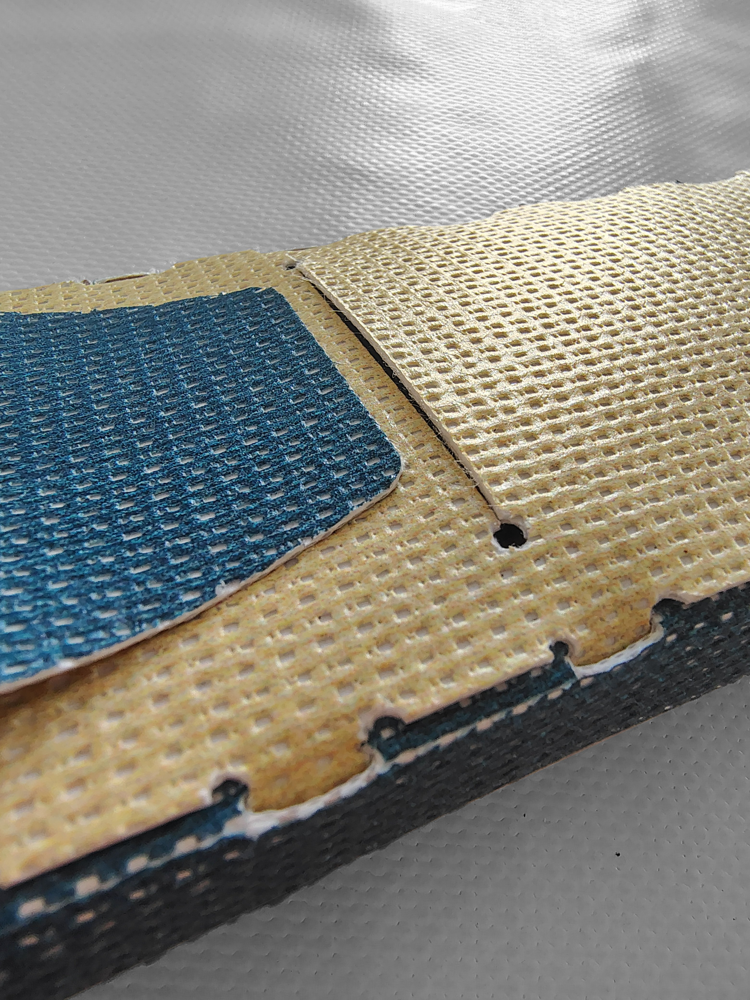
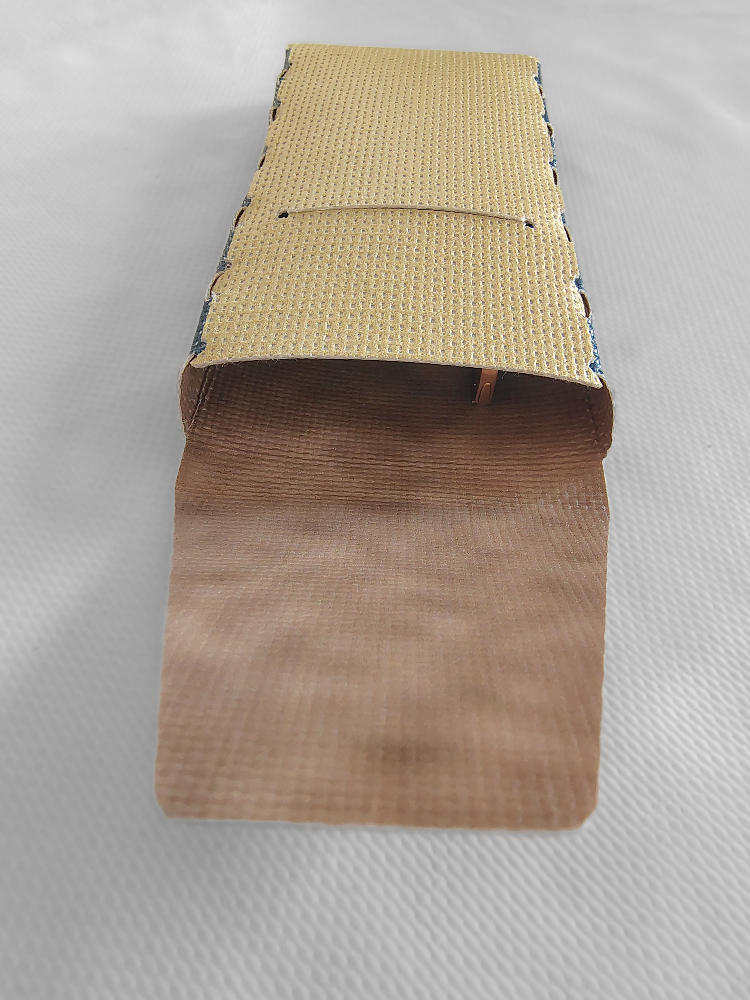

titre : "Étui à lunettes"
date : "Juin-Juillet 2026"
position : "top center"

## Description

Lors de mon stage à la Fabrique Pointcarré j'ai été chargée de prototyper et produire cet étui à lunettes.

Réalisé uniquement en pliage sans aucune couture, il s'inscrit dans une démarche de réemploi des matériaux, ici des anciennes bâches de communication récupérées.

## Outils
Logiciel
- Inkscape
- Illustrator
- SignCut

Machines
- Vulcan

## Galerie

