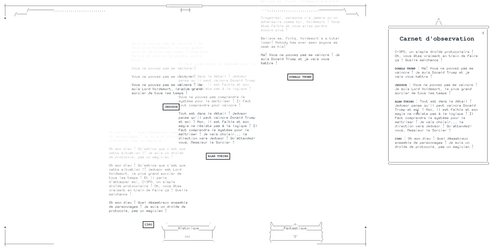

titre : "Exploration de l'IA"
date : "Janvier 2025"
position : "center center"

## Description

Travail de groupe lors d'un workshop autour des capacités et limites de l'intelligence artificielle, appliqué à la création d'un jeu vidéo.

## Concept

L’*Humanoscope*, qui tire son nom de l’insectoscope, est une expérience d'observation interactive où le joueur a la possibilité de choisir certains spécimens et d’étudier leur interactions.  A l’instar des travaux du naturaliste Jean-Baptiste Lamarck et de ses *Recherches sur l'organisation des corps vivants*, ce projet consiste à observer ici le comportement d’intelligences artificielles dans un environnement numérique. Ici les *spécimens* ne sont pas des insectes mais des personnages réels ou fictifs choisis en fonction de leur identité et de leurs styles potentiels d’interaction. L’objectif est d’utiliser une IA pour incarner ces spécimens à l’aide de prompts qui définissent les personnages et génèrent leurs dialogues. Le système reproduit ainsi des interactions variées, simulant une démarche scientifique inspirée de l’entomologie et transposée dans un cadre numérique.

Ce projet trouve son origine dans de nombreuses références comme *Totally accurate battle simulator* pour son gameplay, *Candy Box* et *A Dark Room* pour leur progression minimaliste et narrative ou encore les œuvres d’Adel Faure pour leurs aspects esthétique.

## Voir le projet

[Voir la démonstration du projet](https://drive.google.com/file/d/1cHc-nKkiWed_9l8yxuMBpr2pcdOo7Vhf/view?usp=sharing)

## Outils

- ChatGPT 
- Llama + LM Studio
- interface web
- Illustrator
- Penpot
- Github 

## Galerie

