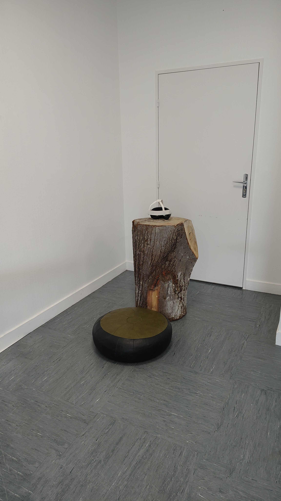
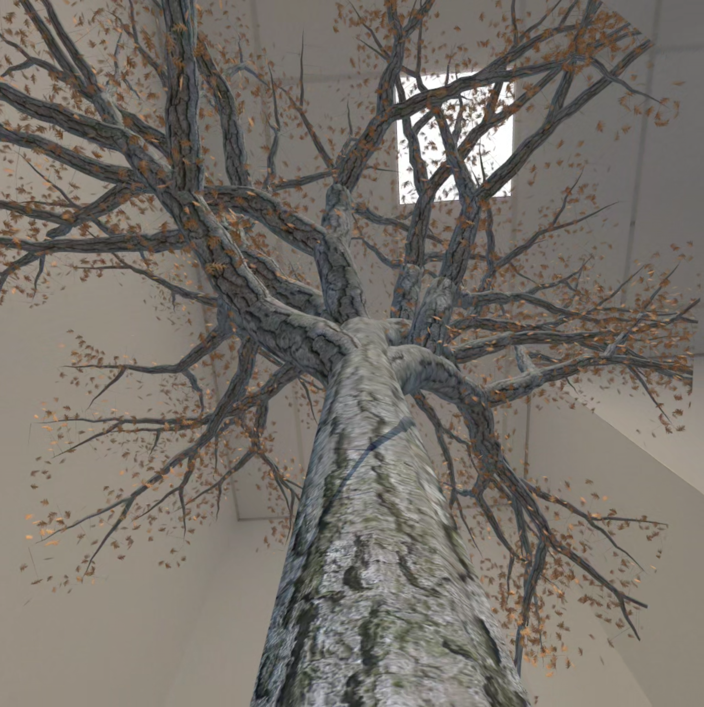
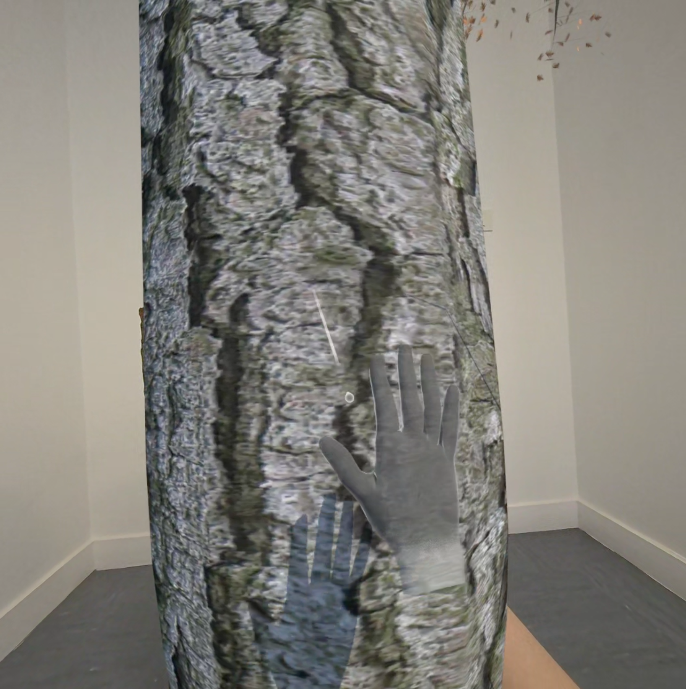
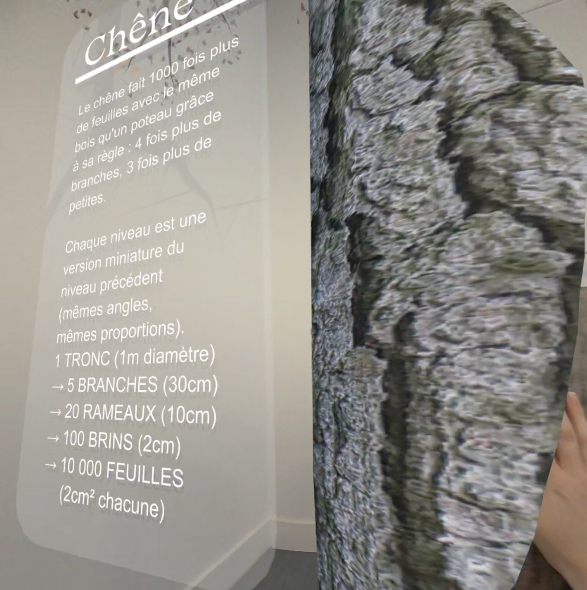
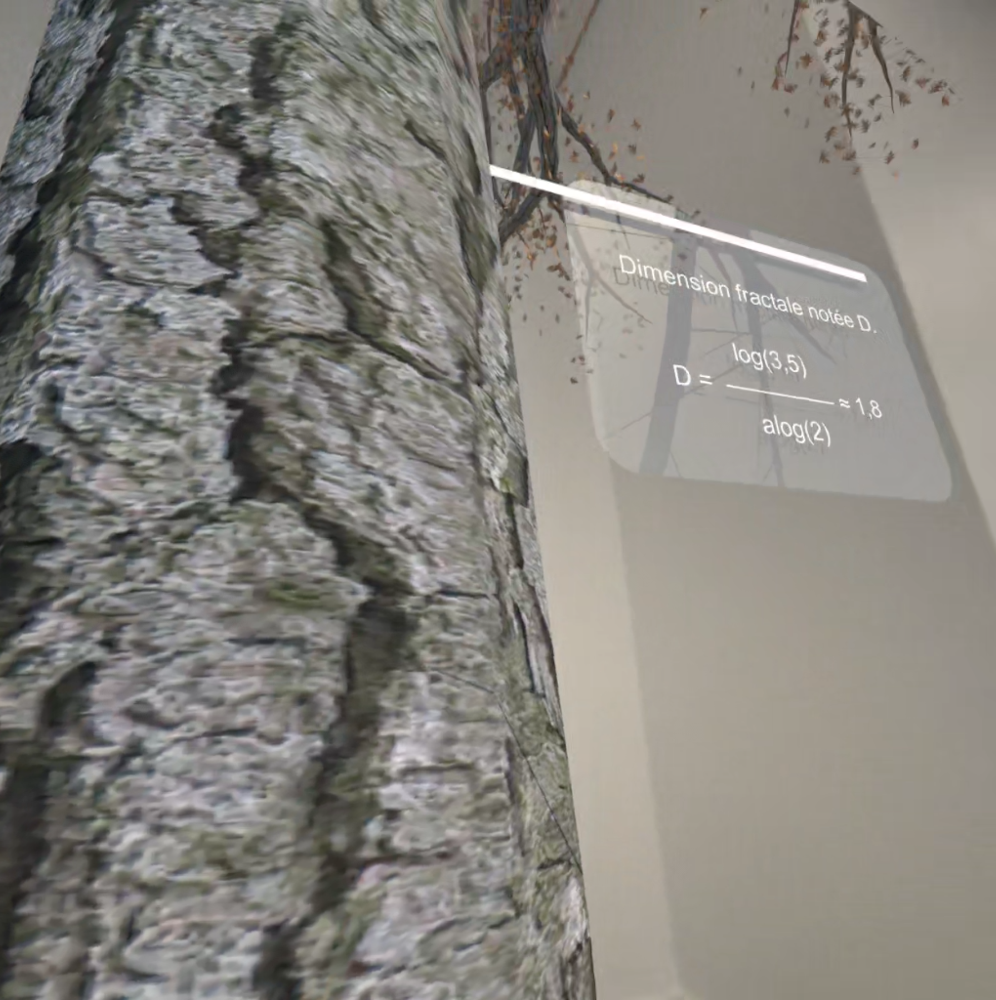
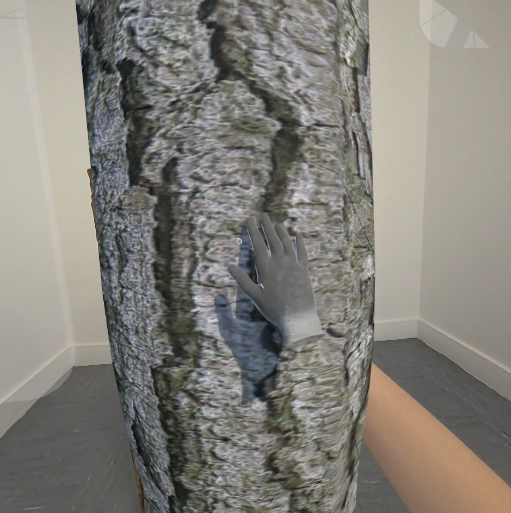

titre : "Fractalab"
date : "2025-2026"
position : "center center"

## Description

[PROJET DNA D'ALICE MASSART : BLOG DE MES RECHERCHES - GITHUB](https://a-massart.github.io/Projet-DNA__Alice-Massart/index.html)

J'ai souhaité de ce projet qu'il me familiarise avec la recherche et la vulgarisation scientifique.

Par le biais de l'art et du design, comment montrer et expliquer la place des fractales dans notre environnement ?

Le terme fractal vient du latin fractus qui veut dire brisé. Les fractales sont des objets ou des géométries irrégulières et fragmentées. On y retrouve des motifs autosimilaires, multi-échelles et parfois infinis.
J'ai choisi les fractales parce qu'elles réunissent plusieurs questions qui traversent déjà ma pratique : un sujet scientifique complexe, une forte dimension visuelle et la possibilité de travailler la transmission auprès d'un public non spécialiste.

J'ai donc passé le premier semestre de cette 3e année à faire des recherches sur le sujet, à explorer les problématiques de l'apprentissage de notions scientifiques, à comprendre moi-même cette notion et les points importants à expliquer.
J'ai créé une sorte de site personnel sur lequel j'ai mis toutes ces recherches sur la manière d'expliquer une science comme les fractales. Je me suis référée à la cité des sciences et à d'autres médias qui traitent la vulgarisation et la médiation scientifique.
J'ai également cherché beaucoup d'exemples, que ce soit dans les sciences, les arts ou la nature.
En creusant le sujet, j'ai trouvé qu'énormément d'éléments du quotidien humain comportent des fractales :
coquillage, plantes, réseau vasculaire de l'humain, nuages, arbres, salade, etc.

À partir de ces recherches, j'en suis venue au fait que la meilleure façon de faire comprendre cette notion serait par l'expérience.
Un jour, en voiture sur une route de campagne, j'ai réalisé que je voyais soudain ces structures fractales partout. Dans les nuages au loin, dans les branches nues des arbres, etc. Cet évènement a confirmé l'idée que l'expérience était le meilleur moyen de ressentir les fractales et qu'une notion scientifique abstraite pouvait devenir une manière différente d'observer le réel.
J'ai donc commencé à développer une expérience immersive en Mixed Reality sur Unity (donc un mélange de VR et de AR) dans laquelle on vit cette expérience de fractale sur un arbre en comprenant que cet arbre est lié aux fractales par l'auto-similiarité de sa ramification.

## Outils

- Unity
- Blender3D
- Github

## Galerie

<video controls autoplay loop src="../../../src/img/travail/2026_fractalab/2026_fractalab_vueVR.mp4" title="Démonstration de l'expérience immersive"></video>