titre : "ICARE"
date : "Avril 2026"
position : "center center"

Au cours du mois d'avril, j'ai eu l'opportunité d'effectuer un stage au laboratoire ICARE (CNRS Orléans), où j'ai travaillé en tant que designer.
Durant ces deux semaines, j'ai notamment développé un prototype de jeu vidéo dans un contexte scientifique.
Ce stage m'a permis d'allier design, programmation et science, et de mieux comprendre comment les outils interactifs peuvent soutenir la production et la transmission des connaissances.

## Description
### Résumé
Dans ce jeu, le joueur incarne un visiteur du laboratoire ICARE (Institut de Combustion Aérothermique Réactivité Environnement) et découvre le quotidien des chercheurs ainsi que leurs sujets de recherche.

### Aspect scientifique

### Équipe
*TUTEUR*  
Stéphane MAZOUFFRE  

*SCIENTIFIQUES*  
Étienne MICHAUX  
Kevin HECKY  
Sara RAGAZZINI  
Lola PATUREL  
Vitor CAVALHERI PEREIRA  
Fabiano PERINI  
Alfredo MARIANACCI  
Antonella CALDARELLI  

## Mes outils
- Godot
- Visual Studio Code
- Krita

## Galerie
<video class="galerie-grand" autoplay loop muted src="../../../src/img/travail/2026_icare/videogame_30-04.mp4" title="Démonstration du jeu ICARE"></video>
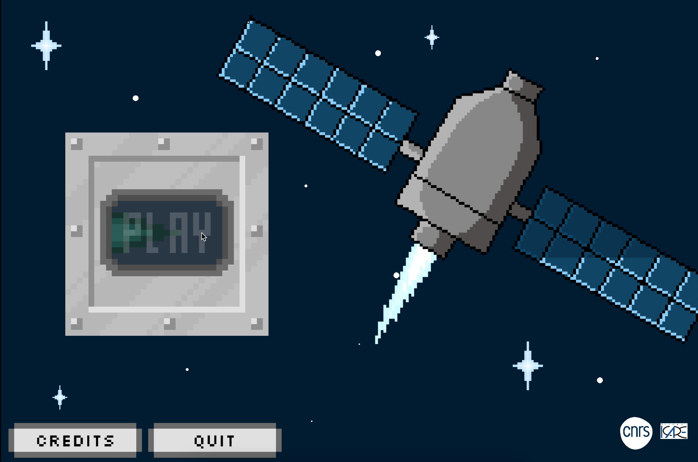
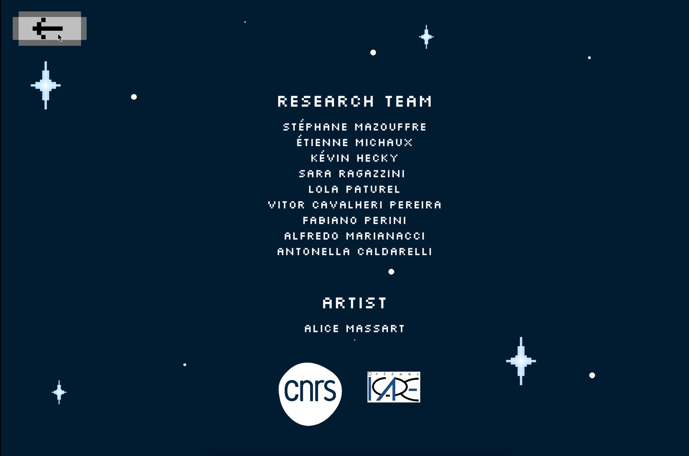
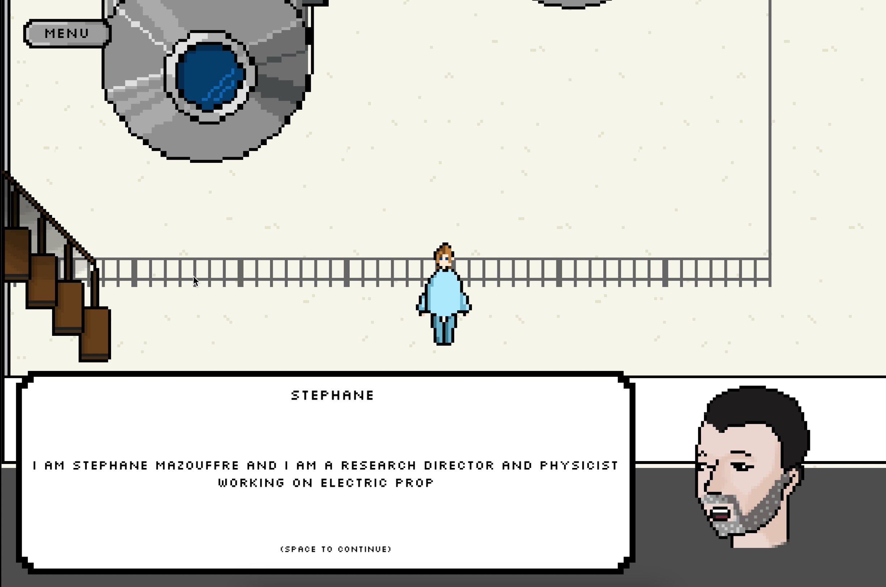
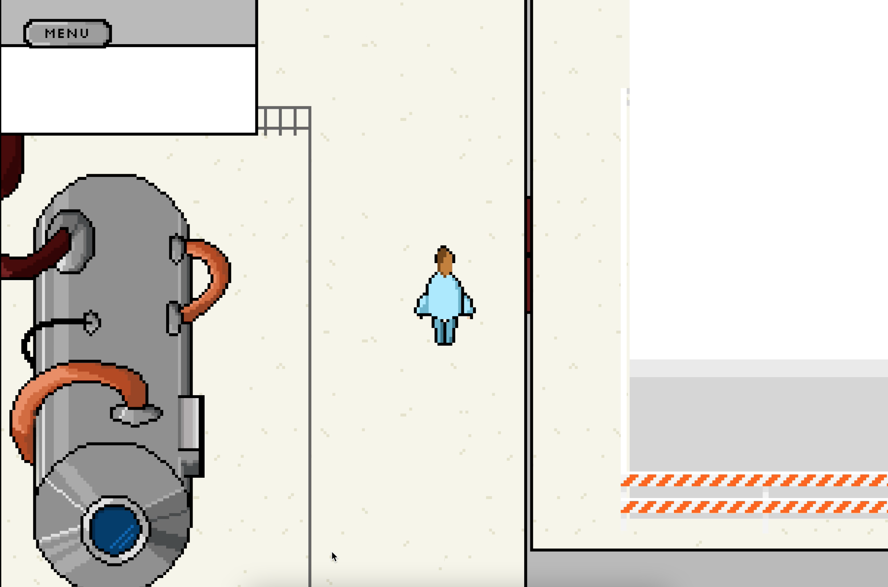
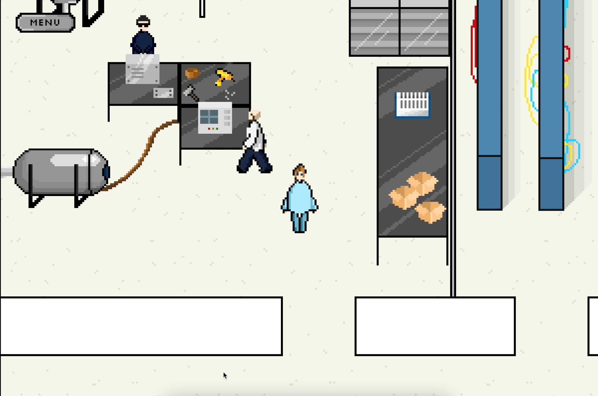
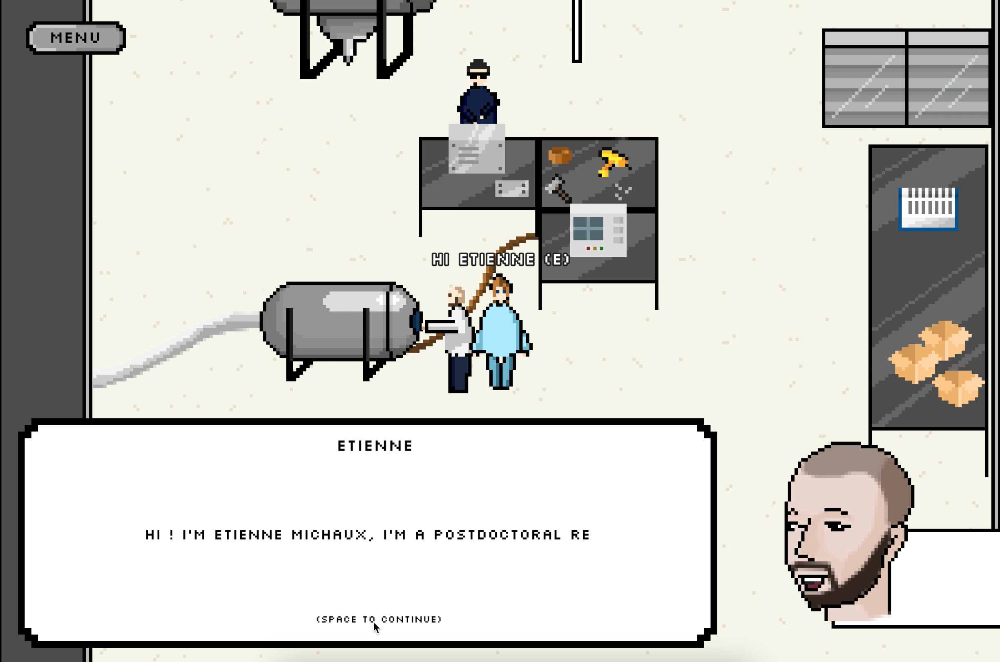
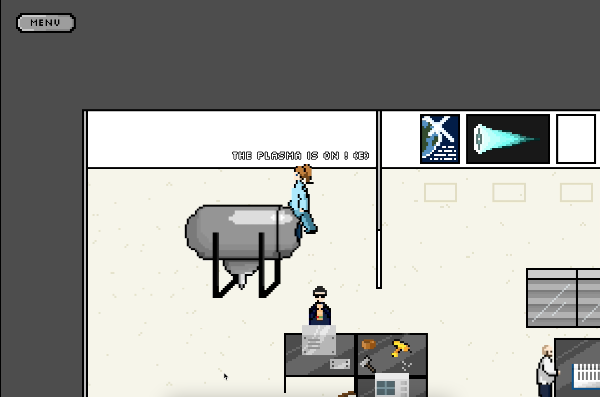
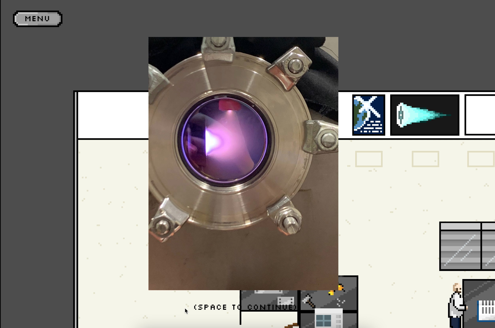
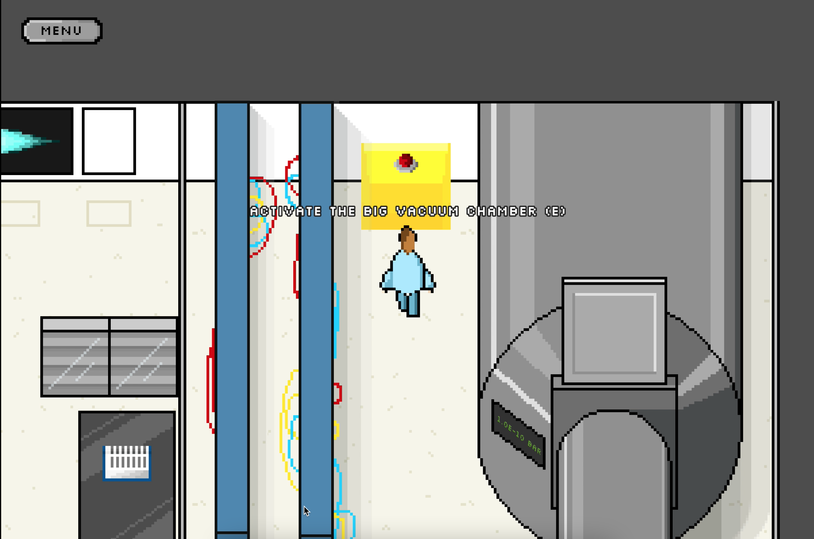
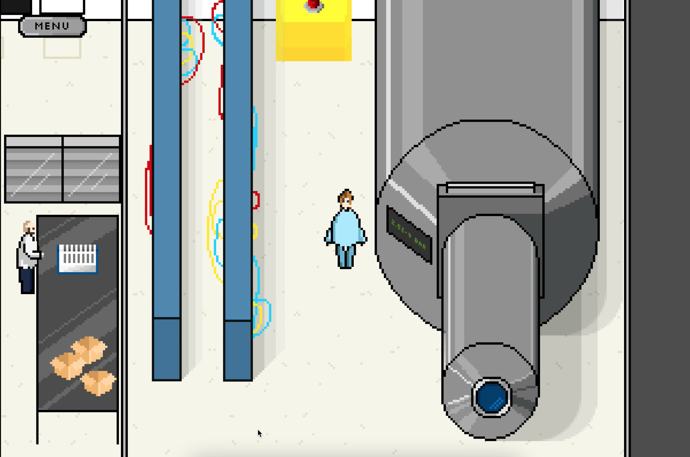
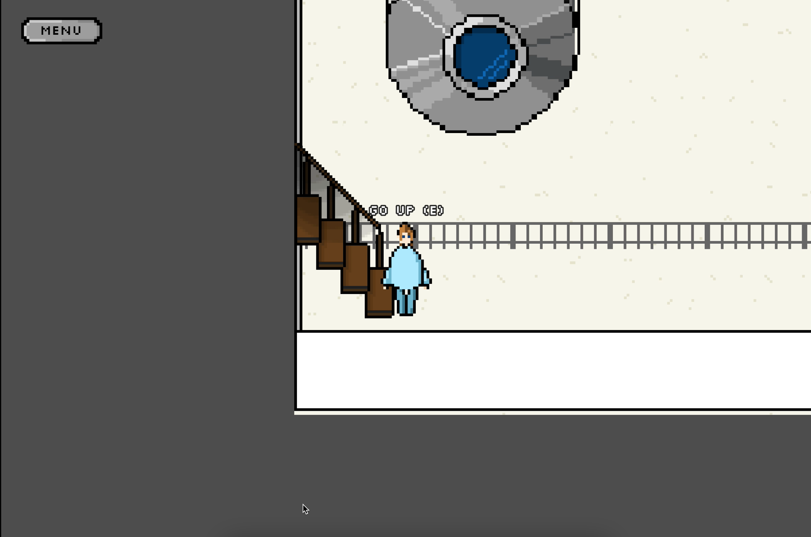
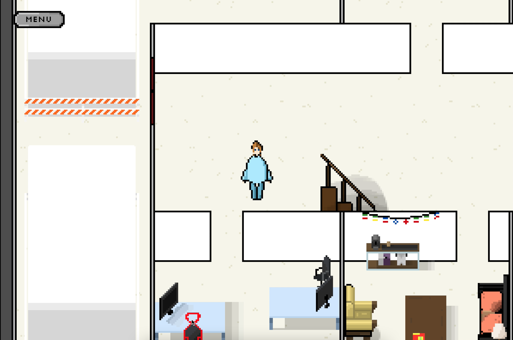
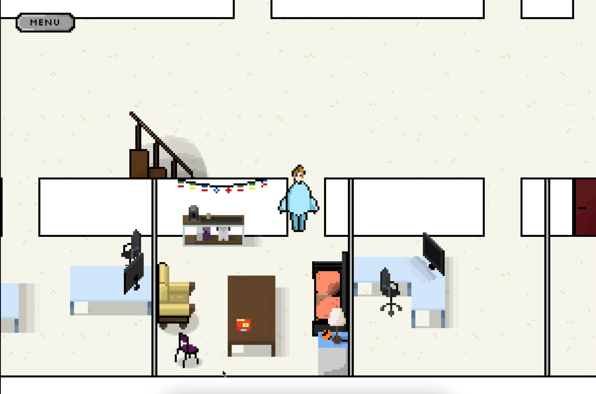
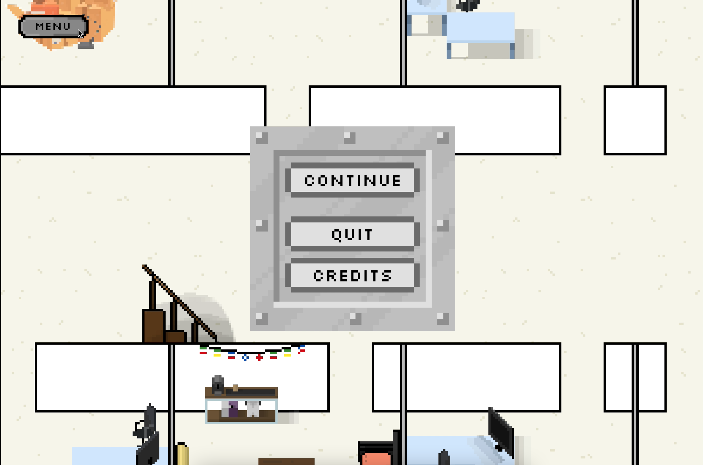