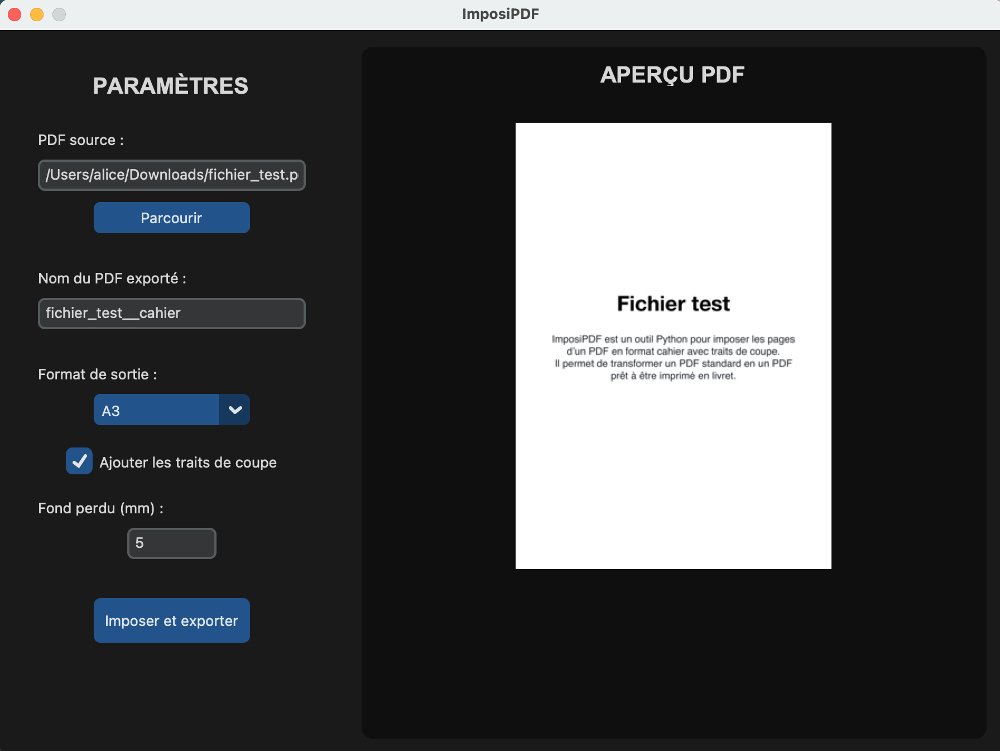

titre : "ImposiPDF"
date : "Octobre 2025 – Janvier 2026"
position : "center center"

## Description

Outil open-source pour imposer les pages d'un PDF en format cahier, utile pour l'impression professionnelle et l'autoédition. Développé avec Python.

## Fonctionnalités

- Imposition automatique au format cahier
- Support des PDF de différentes tailles
- Interface en ligne de commande simple
- Export en PDF prêt à l'impression

## Contexte

J’avais besoin d’un outil pour créer un cahier d’impression à partir d’un PDF. Comme aucun outil simple d'utilisation ne semblait exister, j’ai développé ImposiPDF, installé et utilisé avec succès à l’ESAD Orléans.

## Téléchargement

    <iframe
    frameborder="0"
    src="https://itch.io/embed/4255322?linkback=true&amp;border_width=0&amp;bg_color=22767A"
    width="100%"
    height="100%"
    style="border-radius:10px;">
        <a href="https://alice-massart.itch.io/imposipdf">ImposiPDF by Alice-Massart</a>
    </iframe>

## Galerie

<video autoplay src="../../../src/img/travail/2026_imposipdf/2025_imposipdfV0.mov" title="Toute première version de l'interface : programme s'executant dans le terminal."></video>

