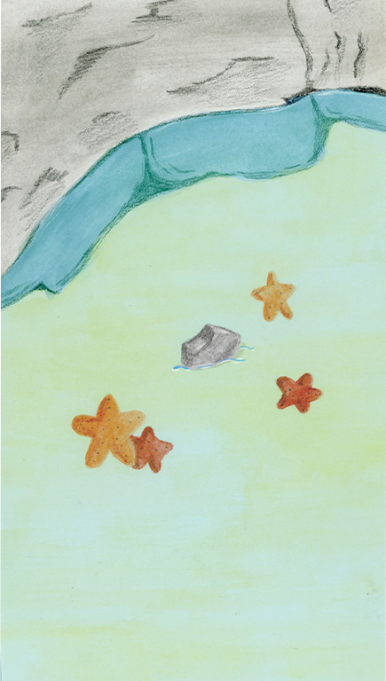
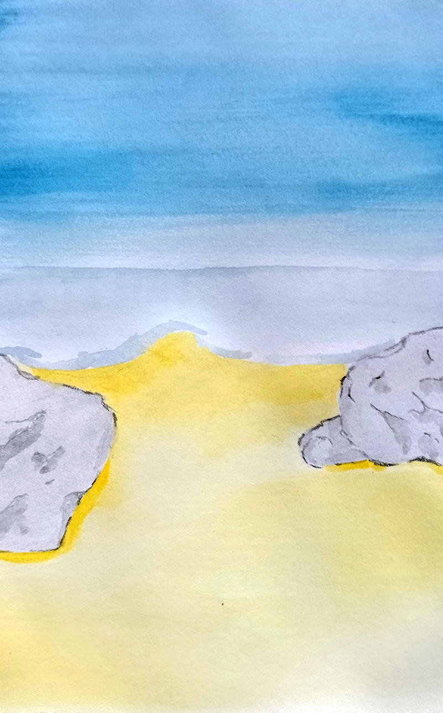
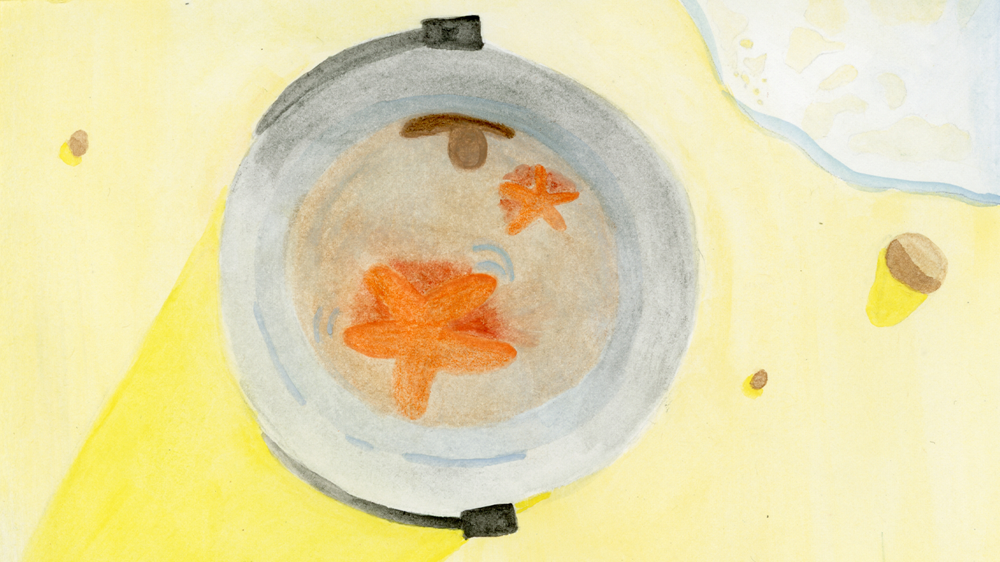
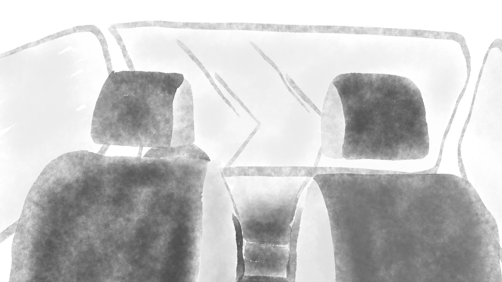

titre : "La Plage Étoilée"
date : "Mars 2024"
position : "center center"

## Description

Jeu à choix multiples réalisé sur Twine. Nous suivons l'histoire d'une petite fille à la plage et les décisions qu'elle prend au fil de son aventure.

## Démarche

Exploration de la narration non-linéaire et de l'écriture interactive.
Le projet met en scène un souvenir d'enfance d'une camarade de classe, un souvenir au bord de mer vu par les yeux de la petite fille qu'elle était.
## Outils

- Twine
- Krita
- Peinture aquarelle et crayons aquarellables

## Galerie

<video class="galerie-grand" autoplay loop muted src="../../../src/img/travail/2024_laPlageEtoilee/2024_LaPlageEtoilee_gameplay.mp4" title="Démonstration du jeu La PLage Étoilée"></video>

