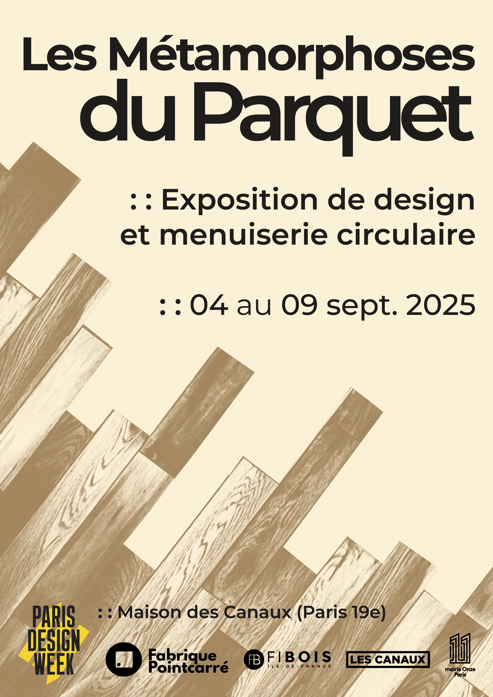
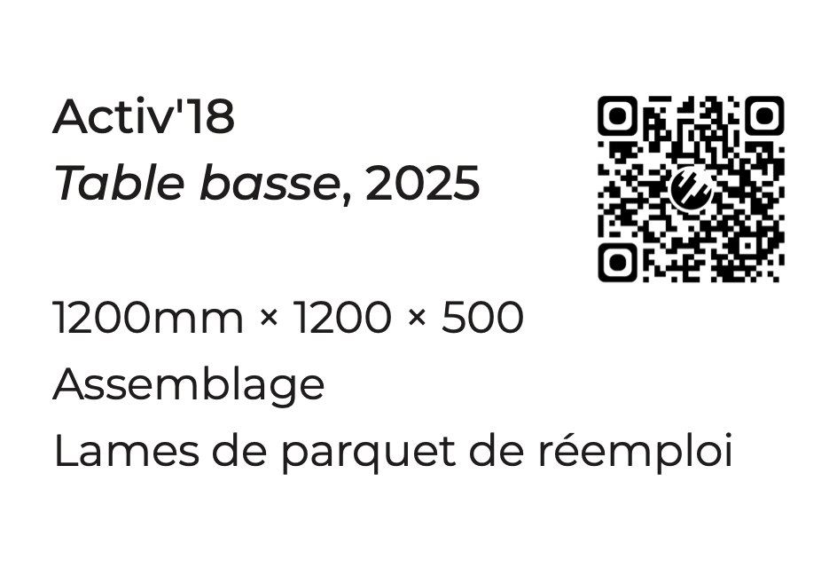
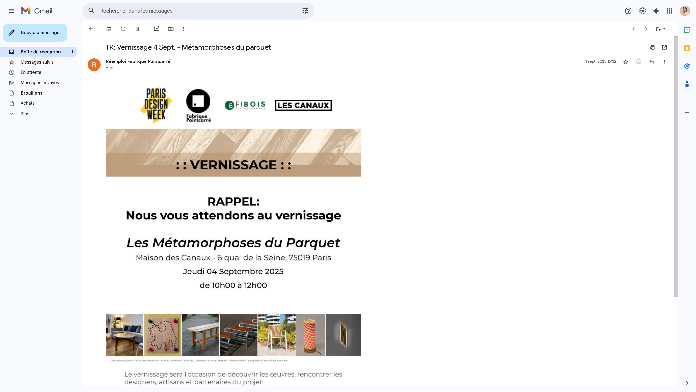

titre : "Les Métamorphoses du Parquet"
date : "Juin 2025"
position : "top center"

## Description

Design graphique de l'exposition *Les Métamorphoses du Parquet*, présentée lors de la **Paris Design Week 2025** à La Maison des Canaux, Paris 19ème, du 04 au 09 septembre 2025.

Collaboration entre **Fabrique Pointcarré** et **Fibois Île-de-France**, autour de la valorisation du parquet comme matériau vivant et évolutif.

[Édition 2025 ⎪ lesmetamorphoses-expo.fr](https://www.lesmetamorphoses-expo.fr/edition-2025)

## Travail réalisé

Conception de l'identité visuelle de l'exposition : affiches, signalétique, supports de communication. La direction artistique s'appuie sur les lignes et textures du bois, entre rigueur géométrique et chaleur du matériau.

## Collaboration

- Fabrique Pointcarré
- Fibois Île-de-France

## Galerie

<video class="galerie-grand" loop autoplay src="../../../src/img/travail/2025_MetamorphosesParquet/2025metamorphoses_website.mov" title="Title"></video>