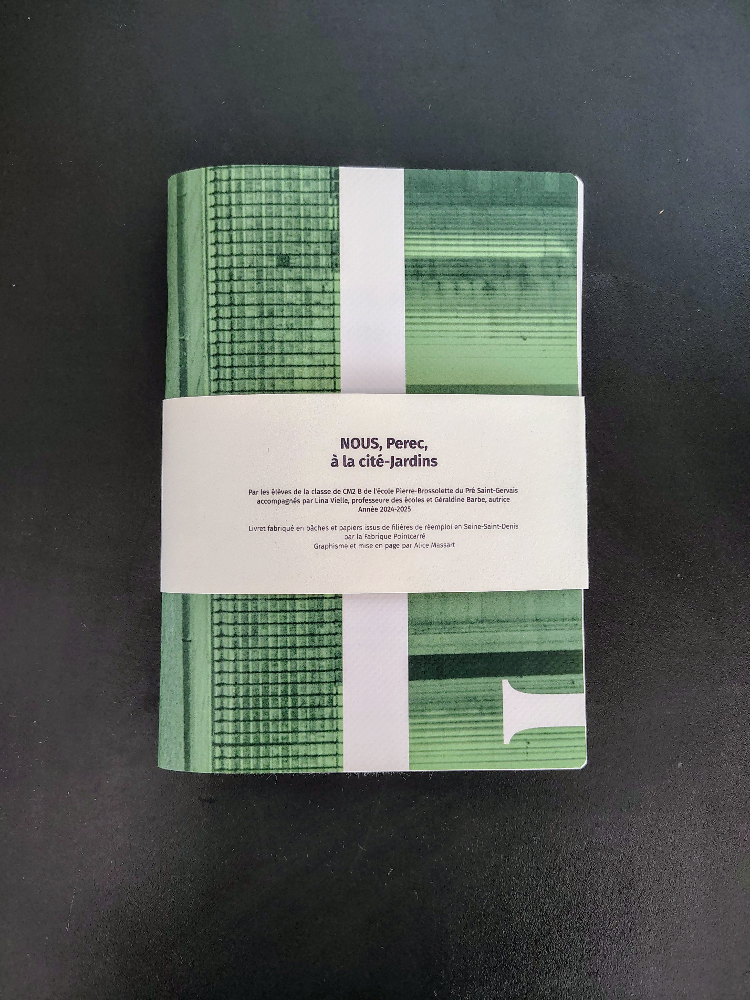
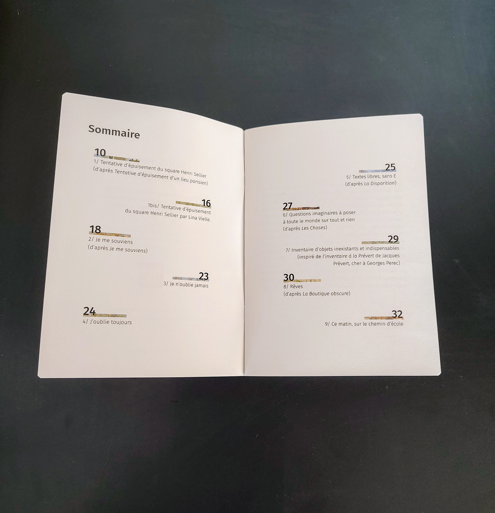
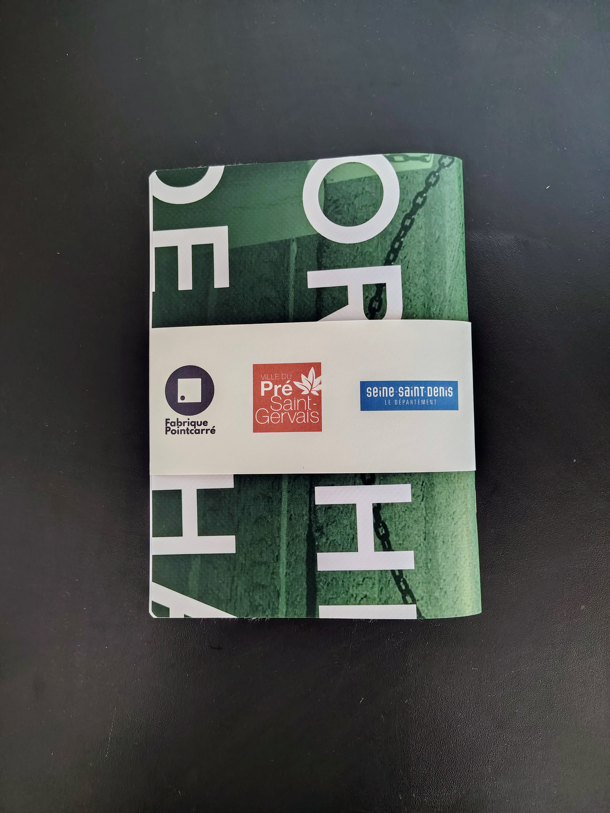

titre : "Nous, Perec, à la cité-jardin"
date : "Juin 2025"
position : "center center"

## Description

Graphisme de cette édition réalisée pour la **ville du Pré-Saint-Gervais**, en lien avec l'œuvre de Georges Perec et le territoire de la cité-jardin.

## Travail réalisé

Conception graphique complète de l'édition : mise en page, typographie, choix des matériaux et suivi d'impression, en collaboration avec **La Fabrique Pointcarré**.

## Collaboration

- La Fabrique Pointcarré
- Ville du Pré-Saint-Gervais

## Galerie

