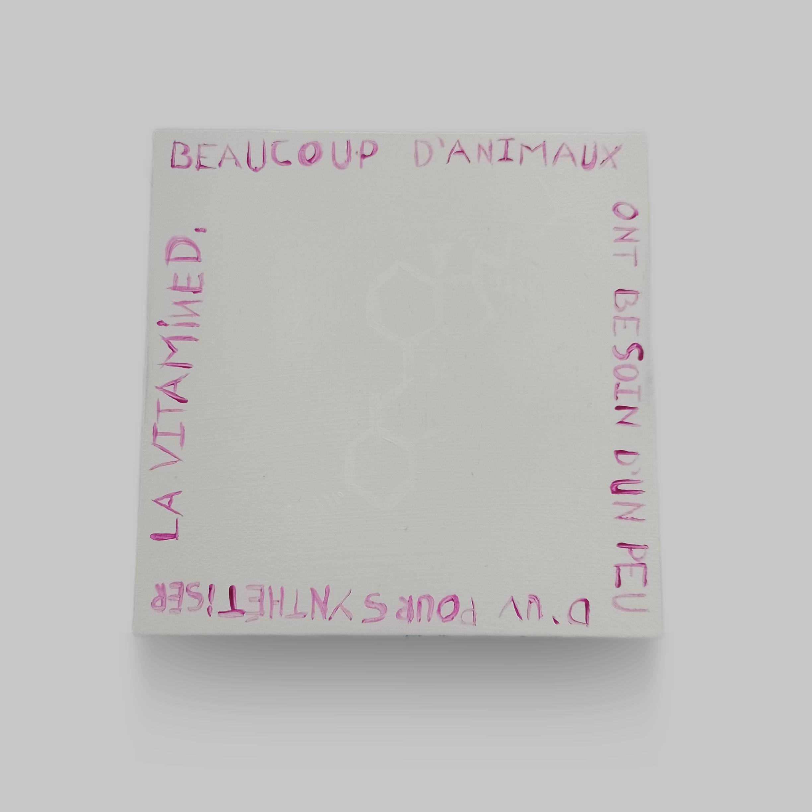
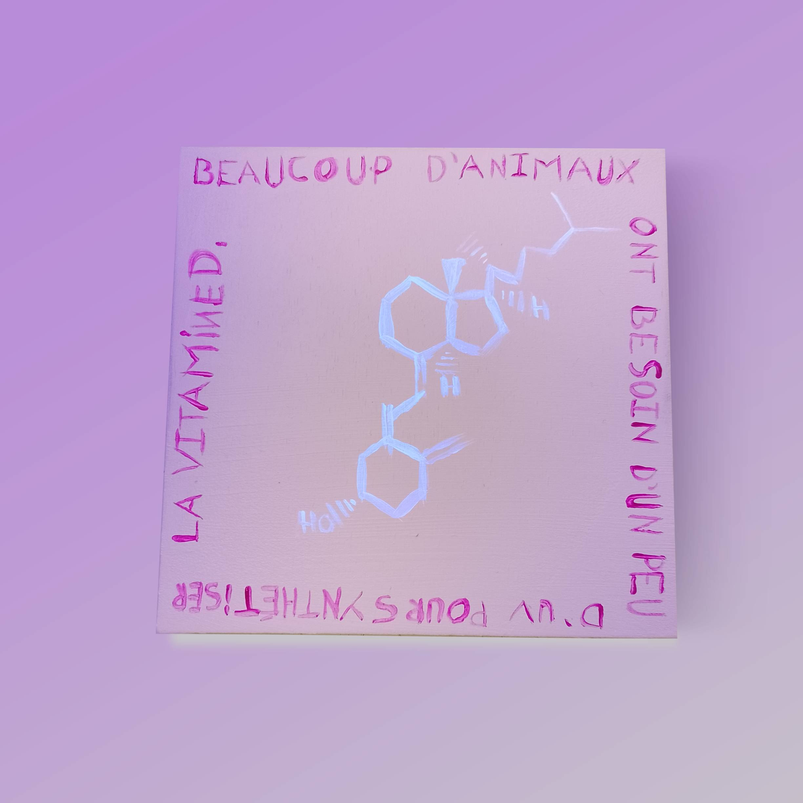

titre : "Participation au projet MetaMistic"
date : "Mars 2025"
position : "center center"

## Description

Participation au projet collectif [MetaMistic](https://metamistic.com/), explorant les possibilités créatives de la peinture réactive aux UV.

## Travail réalisé

Création de compositions sur carré de bois jouant sur les formes et la visibilité : invisibles sous lumière normale, révélées sous lumière noire. Le projet questionne ce qui est montré, caché, et la relation entre l'œuvre et son contexte d'exposition.

## Contexte

Projet artistique collectif : MetaMistic, mis en place par RAISE GROUP (Real Art & In Silico Environment Group), collaboration entre les deux polonais Jacek Kornacki et Maciej Śmietański.

## Galerie

