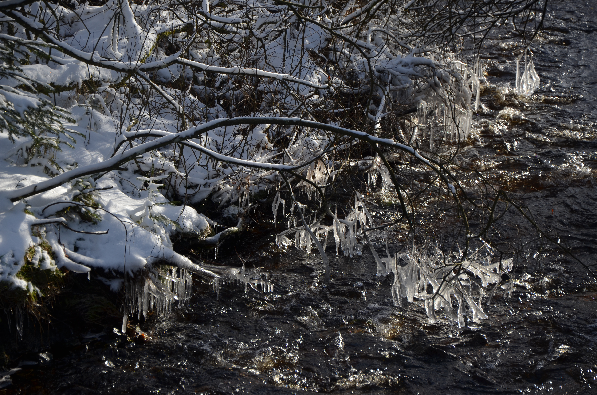
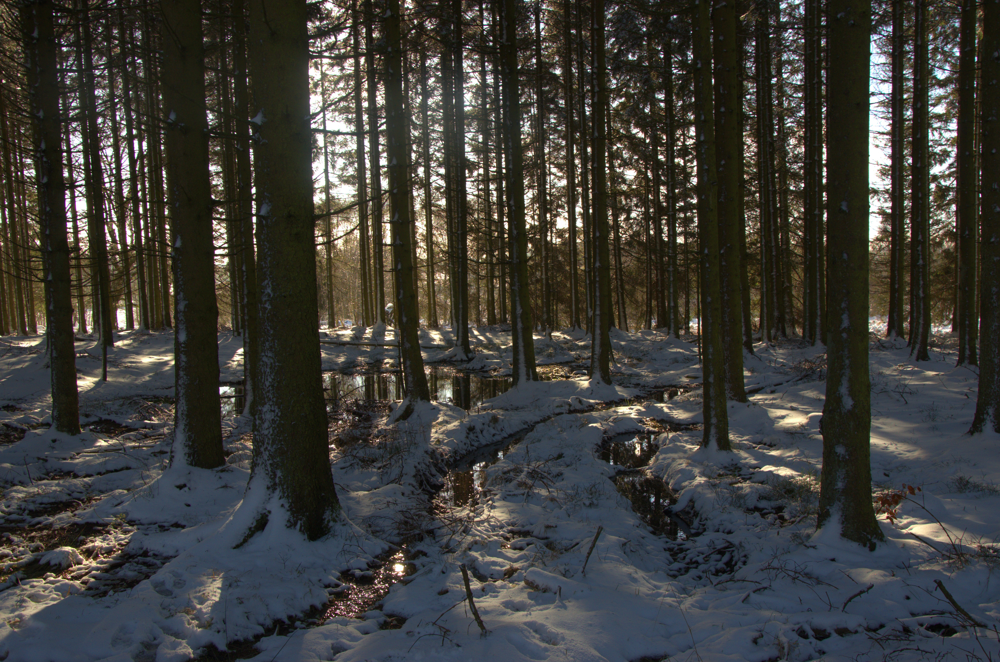
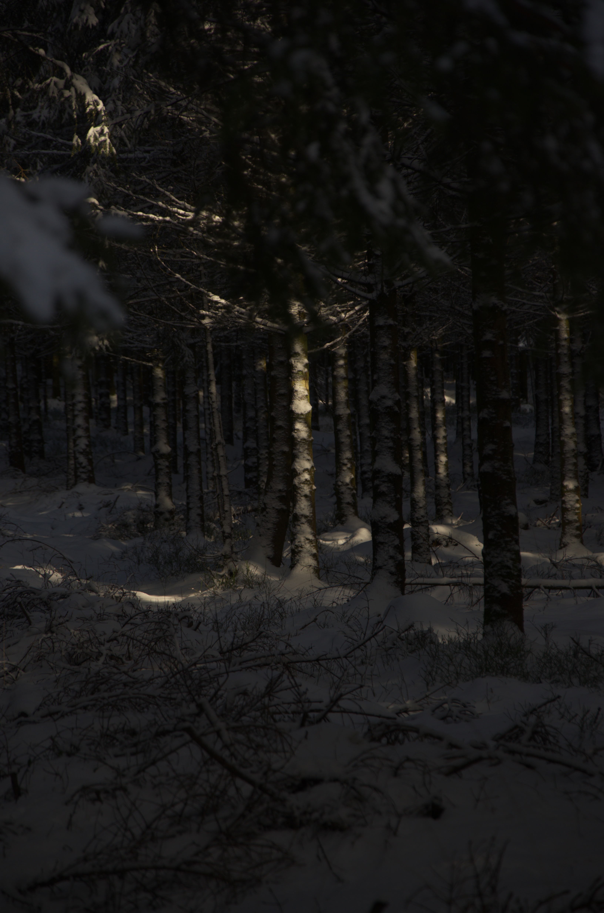
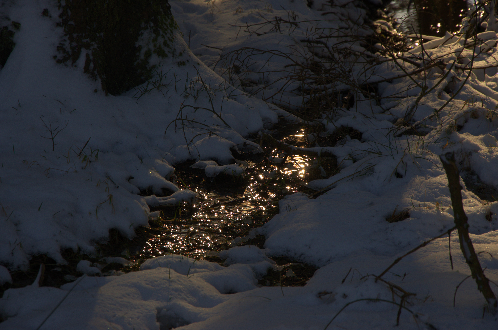
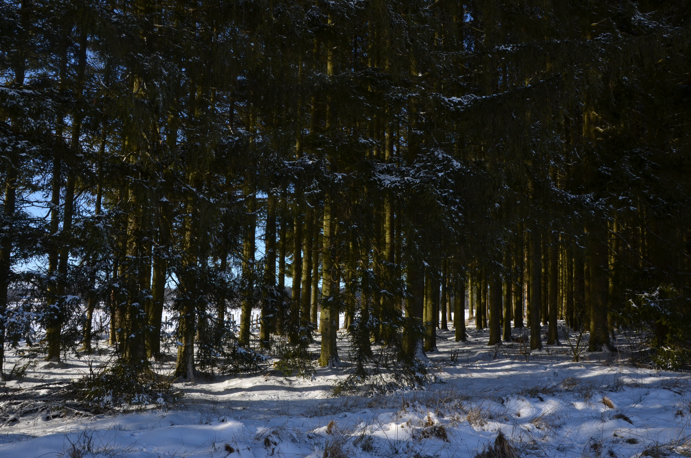

titre : "Photographie"
date : "Décembre 2024 – Janvier 2025"
position : "center center"

## Description

Deux séries photographiques réalisées autour de la **fin d'année**, explorant les ambiances lumineuses de cette période.

## Série de Noël — Décembre 2024

Compositions photographiques à l'occasion des fêtes — jeux de lumières artificielles, décors de saison, atmosphères chaleureuses et graphiques.

## Paysage hivernal — Janvier 2025

Exploration de l'**ombre, la lumière et les contrastes** dans un paysage enneigé en Belgique. Étude des nuances et textures d'un environnement hivernal dépouillé.

## Approche

Ces deux séries explorent comment la lumière transforme un sujet selon le contexte — lumière artificielle festive d'un côté, lumière naturelle hivernale de l'autre.

## Galerie

