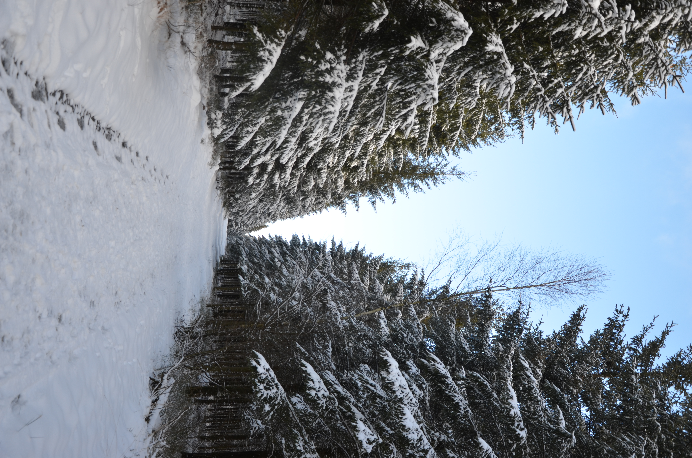

titre : "Photographie"
date : "Décembre 2024 – Janvier 2025"
position : "center center"

## Description

Deux séries photographiques réalisées autour de la fin d'année, explorant les ambiances lumineuses de cette période.

## Approche

Ces deux séries explorent comment la lumière transforme un sujet selon le contexte : lumière artificielle festive d'un côté, lumière naturelle hivernale de l'autre.

## Galerie

