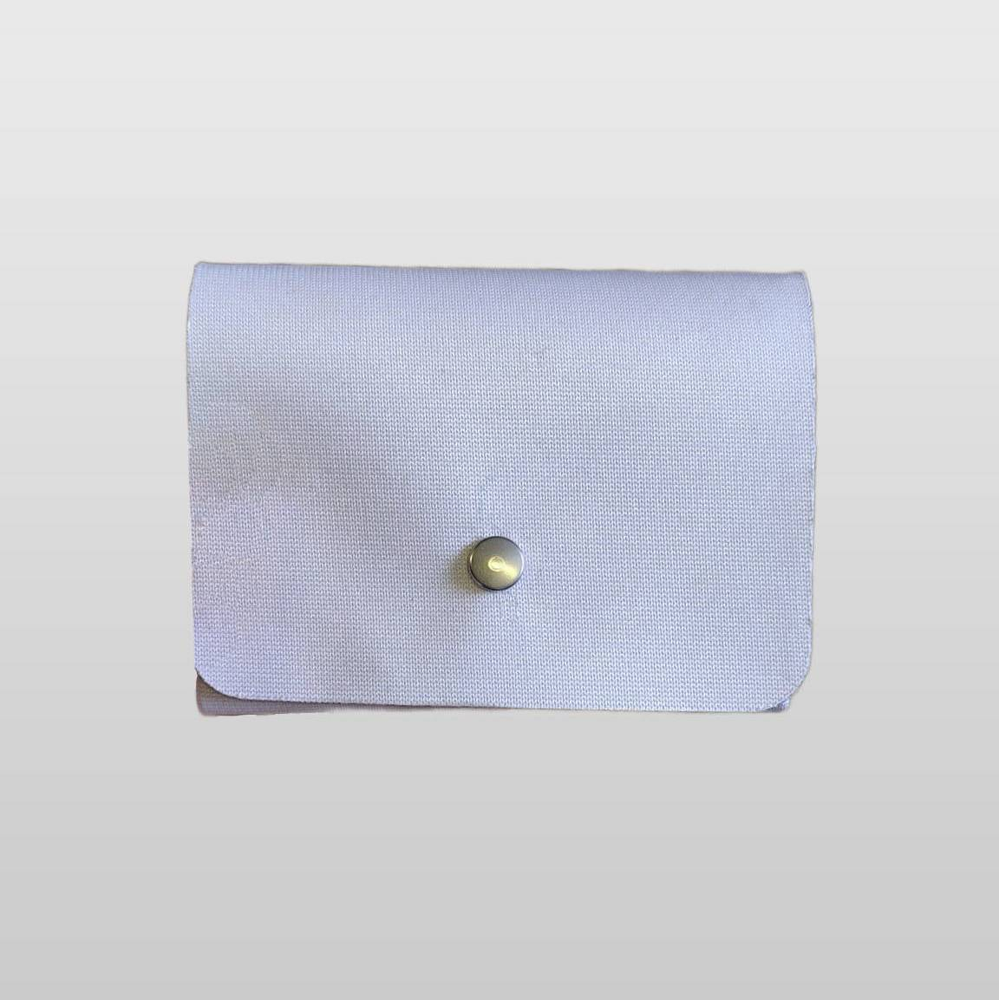
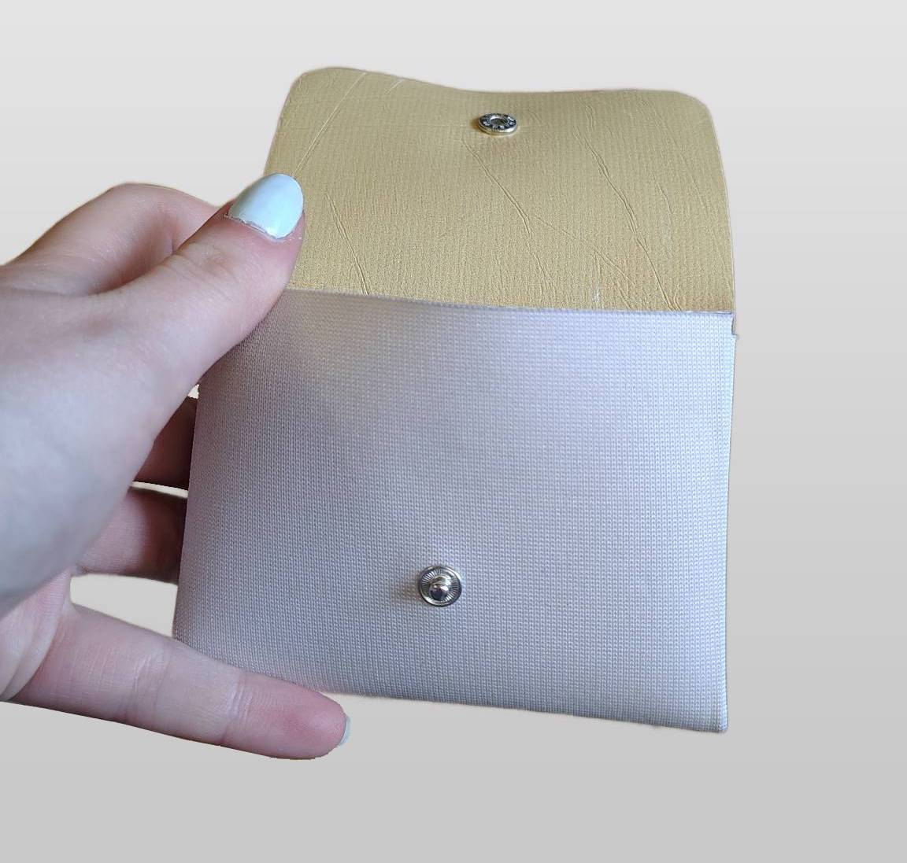
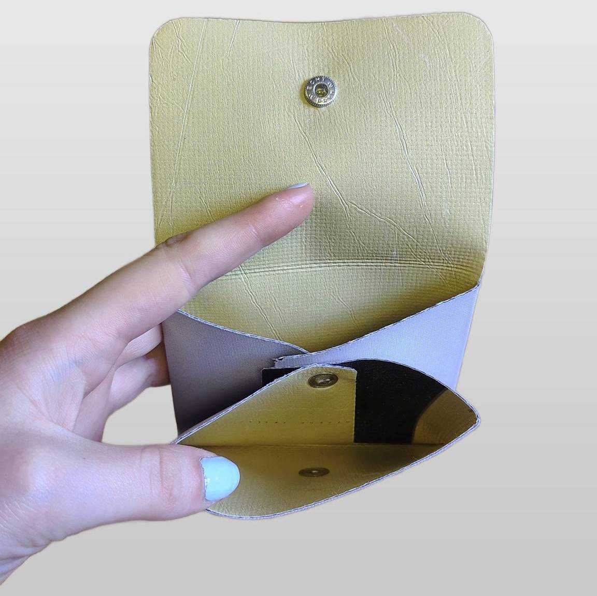

titre : "Porte-monnaie à deux poches"
date : "Juin 2026"
position : "top center"

## Description

Lors de mon stage à la Fabrique Pointcarré j'ai été chargée de prototyper et produire ce porte-monnaie à deux poches.

Cet objet est réalisé avec d'anciennes bâches de communication récupérées, un rivet et un bouton, c'est tout !  
Le reste ?  
Tout est un travail de découpe et de pliage.  

## Outils
Logiciel
- Inkscape
- Illustrator
- SignCut

Machines
- Vulcan
- Sertisseuse à rivets
- Sertisseuse à boutons

## Galerie

