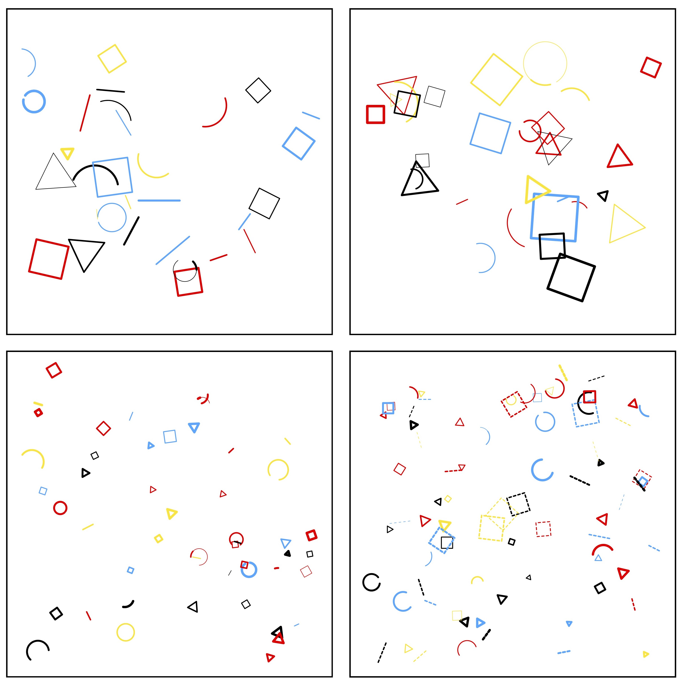
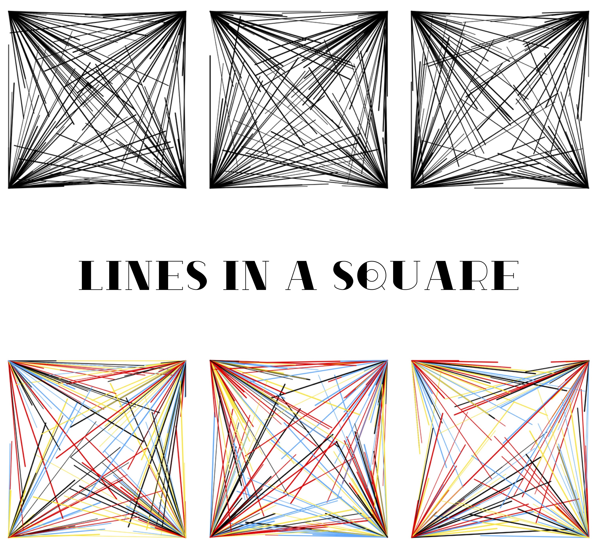
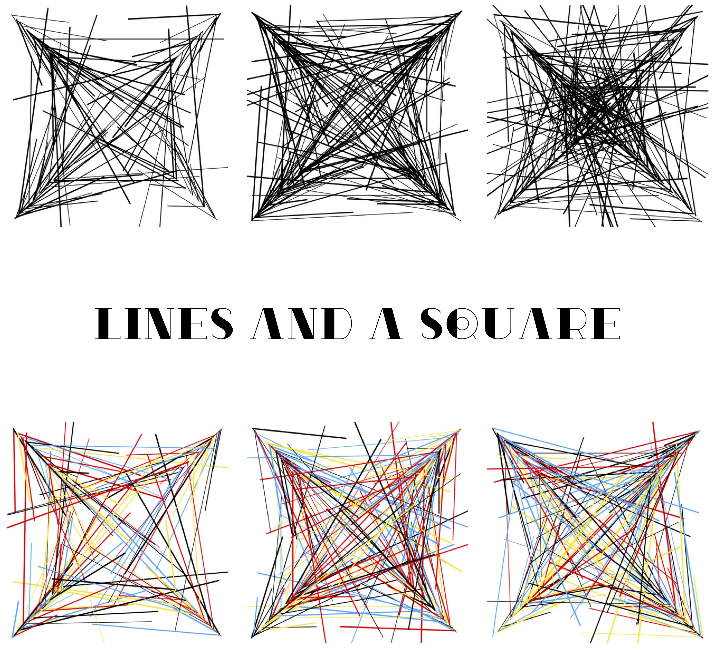
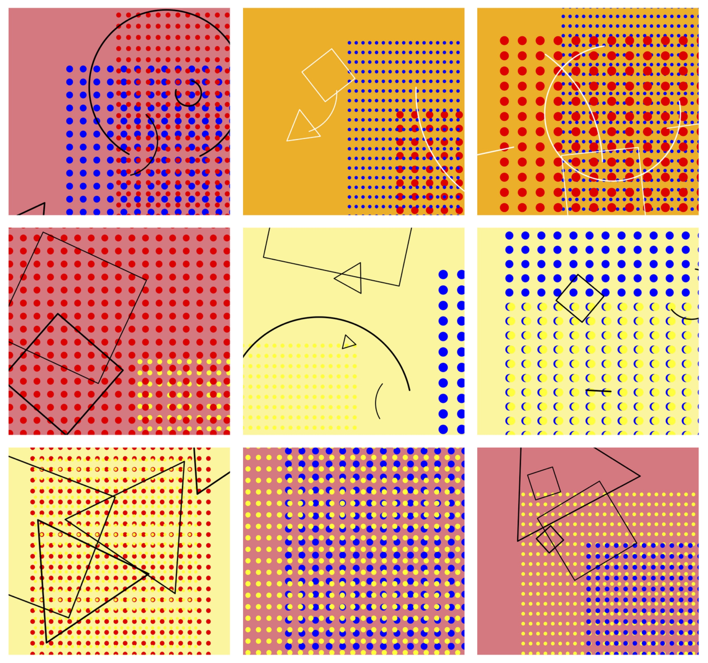
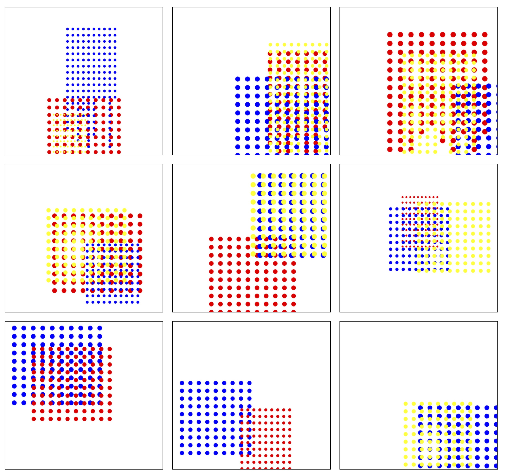

titre : "Exploration de l'art génératif"
date : "Janvier – Mai 2024"
position : "center center"

## Description

Projet personnel d'exploration de l'art génératif : visuels créés de manière algorithmique en Python.

## Démarche

Premières expérimentations autour du code créatif, des formes, couleurs, répétitions et variations générées par des algorithmes. Chaque visuel est à la fois contrôlé dans sa logique et imprévisible dans son résultat.

## Outils

- Python : Librairie turtle

## Galerie

