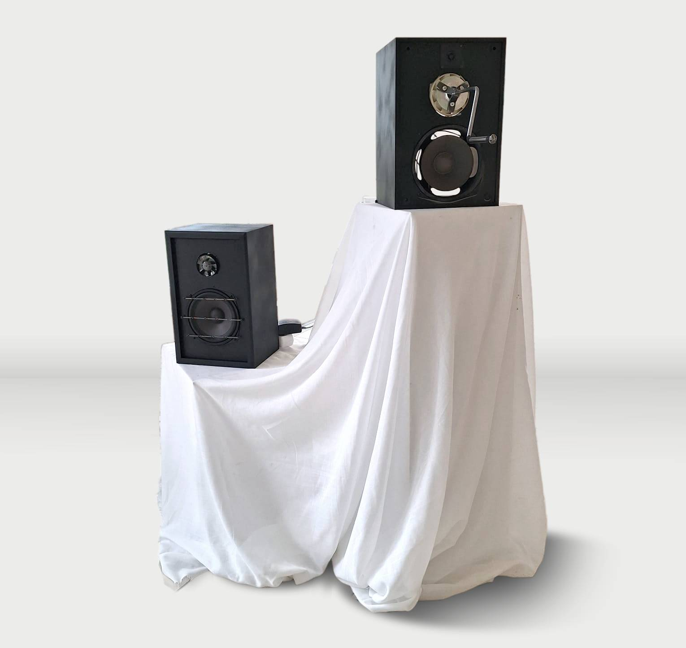

titre : "Recyclage et réutilisation de matériaux électroniques"
date : "Mars 2024"
position : "center center"

## Description

Workshop avec Quentin DESTIEU autour du recyclage et de la réutilisation de composants électroniques pour fabriquer des instruments sonores.

## Concept

Construites en matériaux de récupération et chacune équipée d’un kit électronique Arduino, l’une transforme les vibrations en électricité tandis que l’autre convertit l’énergie mécanique en énergie électrique. Leurs interactions créent des sons surprenants comme grondements et larsens.

## Galerie
