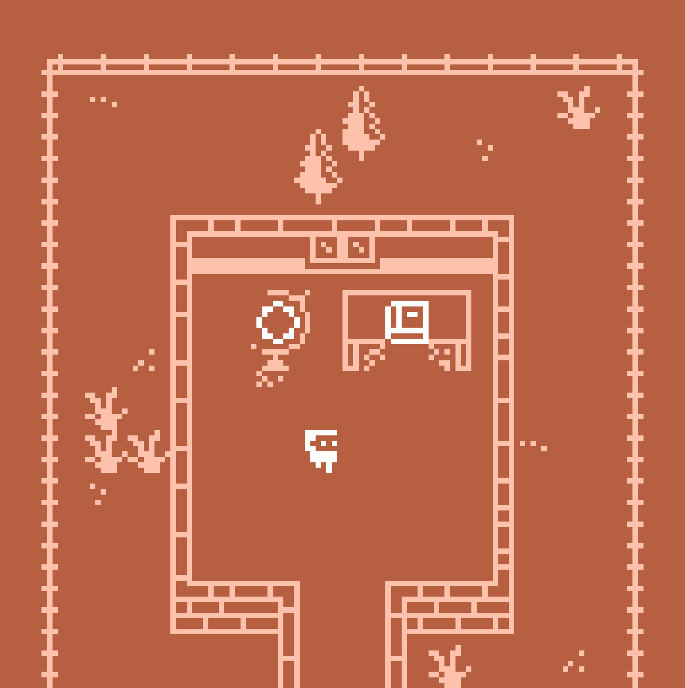

titre : "Situ'Tip"
date : "Mars – Avril 2024"
position : "center center"

## Description

Jeu coopératif en pixel art inspiré de *Keep Talking and Nobody Explodes*, mélangeant support numérique et support papier.

## Concept

Dans ce jeu, j'ai exploré l'érotisme à travers la relation entre deux partenaires et la façon dont l'extérieur peut venir s'y immiscer. Il s'agit donc d'un jeu à deux joueurs, mêlant papier et numérique.

Pour construire cet univers, j'ai demandé à des camarades de me livrer un conseil en amour. C'est à partir de ces conseils que j'ai imaginé les interactions entre les personnages ainsi que la narration.

Les deux joueurs vivent ainsi des aventures communes faites de communication, de contemplation et de questionnement.

À travers ce jeu, j'ai cherché à transmettre des conseils de vie quotidienne, en fusionnant les expériences de chacun de ces camarades.

## Outils

- Moteur de création de jeu vidéo : Bitsy

## Galerie

<video class="galerie-grand" autoplay loop muted src="../../../src/img/travail/2024_situtip/2024_situtip_gameplay.mp4" title="Démonstration du jeu SituTip"></video>

