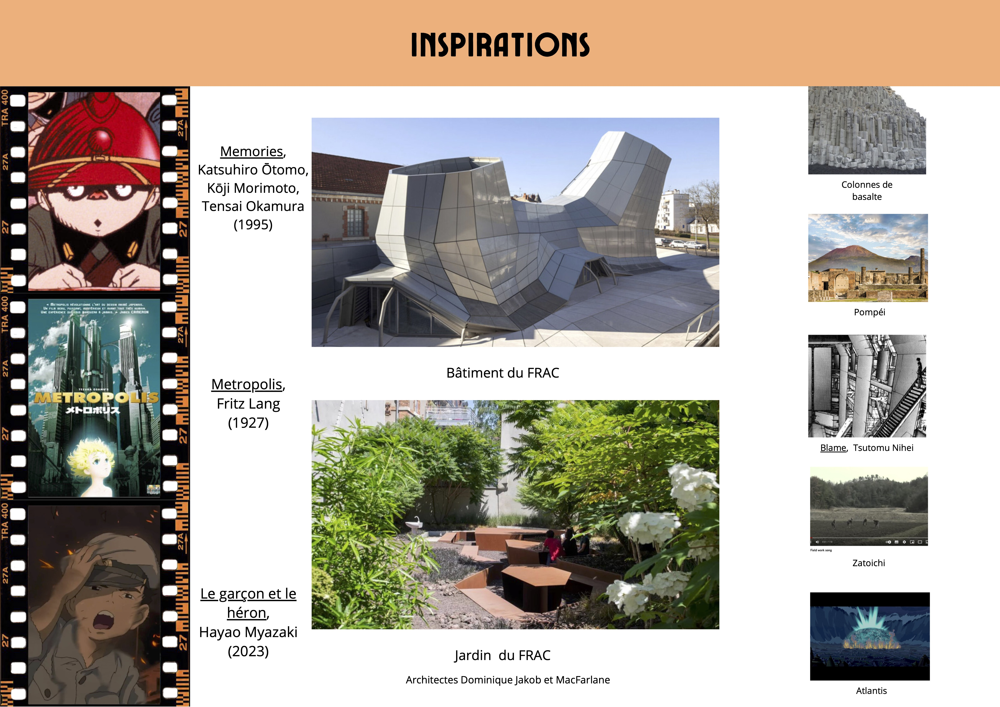
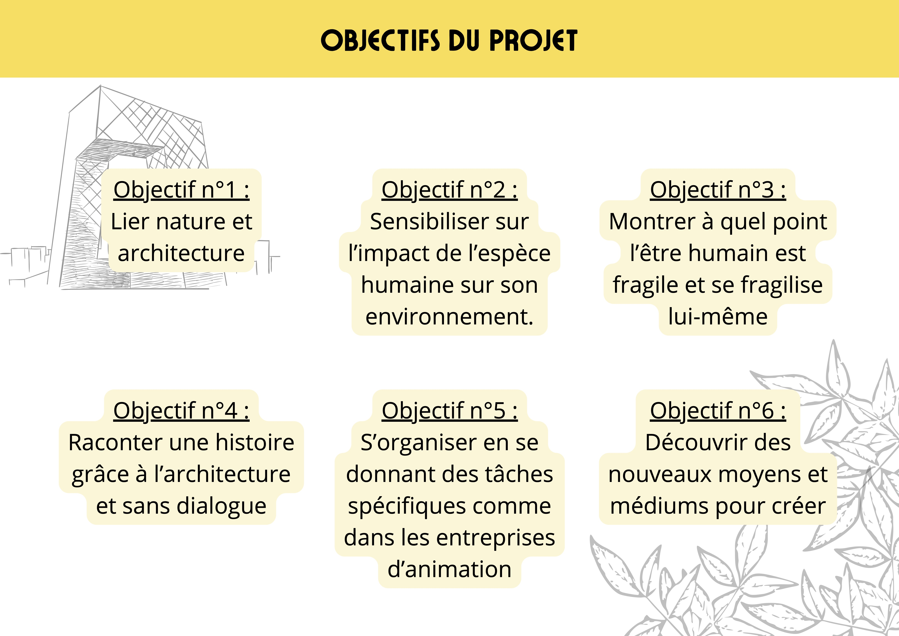
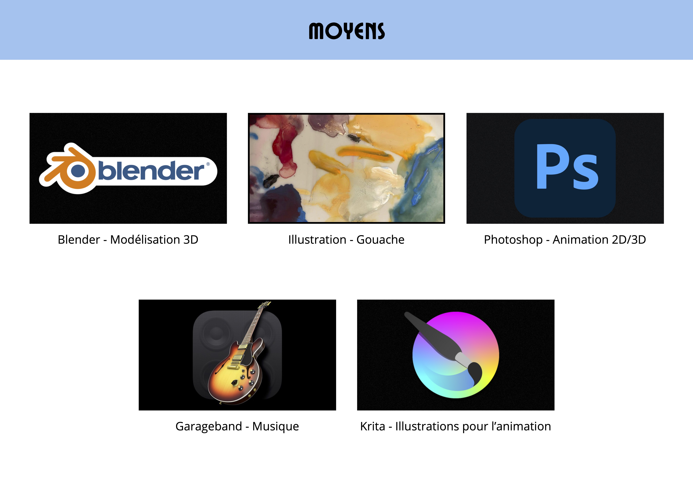
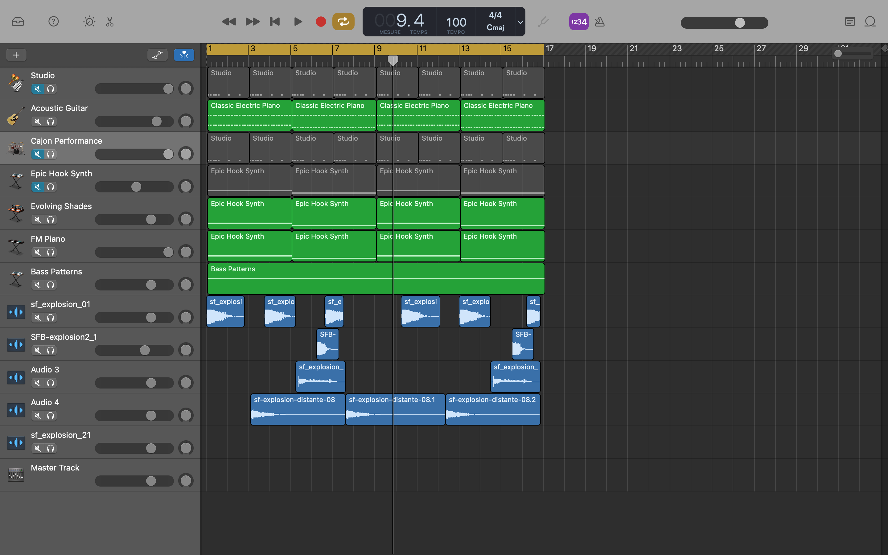
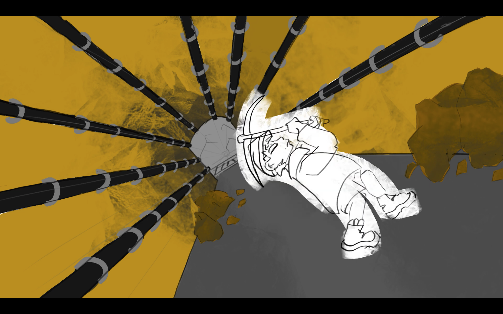
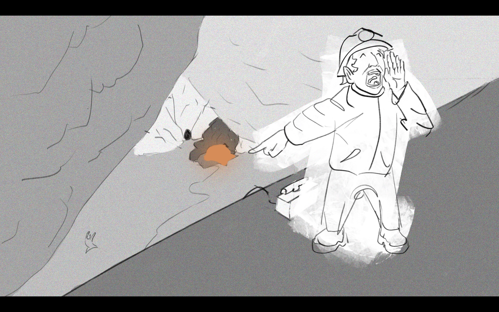

titre : "Volcano"
date : "Septembre – Décembre 2023"
position : "center center"

## Description

Projet de groupe s'inspirant d'œuvres du FRAC d'Orléans pour créer un storyboard animé, première étape vers un court film d'animation.

## Mon rôle

Design sonore : composition et création de l'ambiance sonore accompagnant le storyboard animé.

## Voir le projet

[Visionner le storyboard animé final](https://drive.google.com/file/d/1NOyF464H74VYy8bsy97YWyaSz86JqJCY/view)

## Contexte

Projet collectif réalisé à l'ESAD Orléans avec Martin MARTINOV et Jade JARRY.

## Galerie

